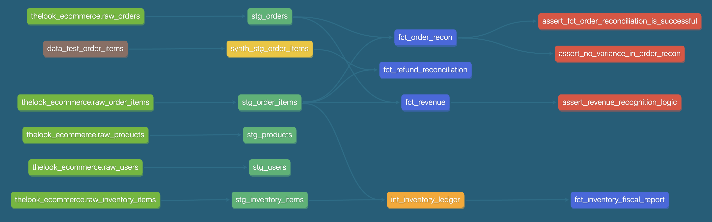
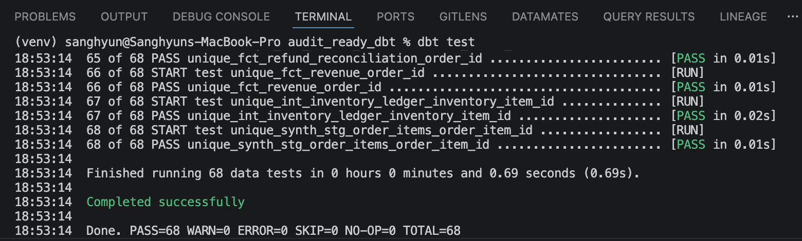
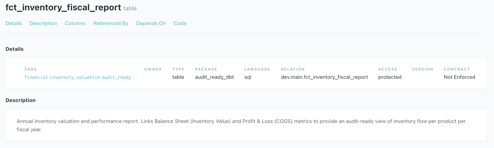
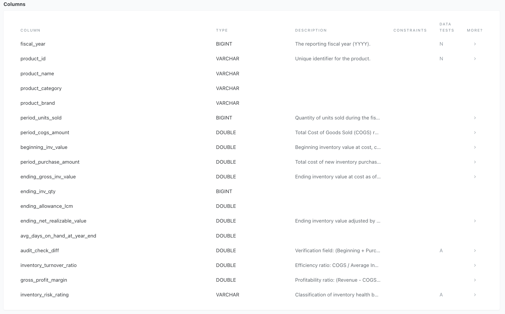
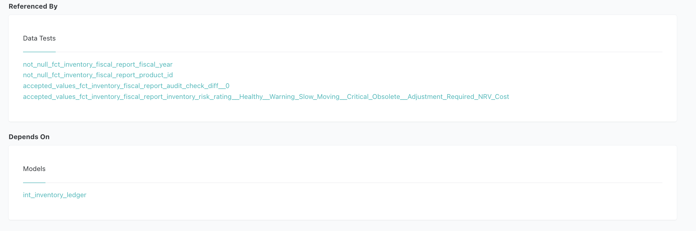

# Analytical Engineering Project
**Financial Data Pipeline & Reconciliation: E-commerce Case Study**
> **CPA's perspective on ensuring financial data integrity using the Modern Data Stack**

---

## 1. Project Overview
* **Objective**: Transforming raw transactional logs into "Audit-Ready" financial marts.
* **Core Value**: Implementing automated "Internal Controls" within the data pipeline to bridge the gap between system logs and GAAP/IFRS standards.

---

## 2. Hybrid Data Architecture
I adopted a hybrid architecture to balance development efficiency with production scalability.

### 1. Ingestion & Synthetic Data Generation
* **Python Extraction** (📂 `scripts/ingest_data.py`): Extracts BigQuery raw data into local **Parquet** files via API.
* **Synthetic Engineering** (📂 `scripts/create_sample_order_items.py`): Generates **"Partial Refund"** scenarios to validate edge-case reconciliation logic.
* **Local Data Lake**: 
    - 📂 `data/raw_orders.parquet`, `raw_order_items.parquet`, `raw_products.parquet`, `raw_users.parquet`, `raw_inventory_items.parquet`
    - 📂 `seeds/data_test_order_items.csv` (**Synthetic Seed** for logic verification)

### 2. High-Performance Local Development
* **Engine**: Powered by **DuckDB**, optimized for **Apple Silicon** to enable rapid iteration with zero cloud costs.
* **Multi-Environment**: **dbt profiles** (`profiles.yml`) are configured to switch from local DuckDB to **BigQuery** with a single command.

### 3. Modular Transformation (dbt)

**Visualizing the Audit-Ready Data Pipeline**
* **Layered Architecture**: Implemented a 3-tier structure (Staging → Intermediate → Marts) to ensure data traceability.
* **Color-Coded Nodes**:
    - 🟢 Light Green: Raw Sources
    - 🟤 Brown: Seeds (Generated synthetic data)
    - 🟩 MediumSeaGreen: Staging Layer (Initial cleaning and casting)
    - 🟡 Yellow: Synthetic Test Layer (Partial Refund Scenario injection)
    - 🟠 Orange: Intermediate Layer
    - 🔵 RoyalBlue: Final Financial Marts
    - 🔴 Red: Automated Data Quality Tests

#### Model Directory
* **Staging Layer**:
    - 📂 `models/staging/stg_orders.sql`
    - 📂 `models/staging/stg_order_items.sql`
    - 📂 `models/staging/stg_products.sql`
    - 📂 `models/staging/stg_users.sql`
    - 📂 `models/staging/stg_inventory_items.sql`
    - 📂 `models/staging/synth_stg_order_items.sql` (**Test Layer**)
* **Intermediate**: 
    - 📂 `models/intermediate/int_order_items_summary.sql`: Sub-ledger aggregation per `order_id` (item count, total amount, refund rollup).
    - 📂 `models/intermediate/int_inventory_ledger.sql`
* **Marts (Audit Layer)**:
    - 📂 `models/marts/fct_order_recon.sql`: Master-to-Subledger reconciliation.
    - 📂 `models/marts/fct_revenue.sql`: Accrual-based revenue recognition.
    - 📂 `models/marts/fct_refund_reconciliation.sql`: Linking refunds to original orders.

### 4. SCD Type 2 Snapshot (Product Price Tracking)
* **File**: 📂 `snapshots/scd_products.sql`
* **Strategy**: `check` — tracks row-level changes on `cost`, `retail_price`, `product_name`, `category` using `dbt snapshot`.
* **Purpose**: Maintains a full historical record of product price and category changes, enabling point-in-time inventory valuation and audit traceability without overwriting prior states.
* **Hard Delete Handling**: `invalidate_hard_deletes=True` ensures removed products are flagged rather than silently dropped from history.

### 5. Quality Control
* **Automated Reconciliation**: Custom dbt tests to flag financial discrepancies.

    * **Model Schema Tests** (column-level constraints & descriptions):
        - 📂 `models/staging/source.yml`
        - 📂 `models/staging/stg_orders.yml`, `stg_order_items.yml`, `stg_products.yml`, `stg_users.yml`, `stg_inventory_items.yml`
        - 📂 `models/staging/synth_stg_order_items.yml`
        - 📂 `models/intermediate/int_inventory_ledger.yml`, `int_order_items_summary.yml`
        - 📂 `models/marts/fct_order_recon.yml`, `fct_revenue.yml`, `fct_refund_reconciliation.yml`, `fct_inventory_fiscal_report.yml`
    * **Custom Assertion Tests** (business-logic validation):
        - 📂 `tests/assert_fct_order_reconciliation_is_successful.sql`
        - 📂 `tests/assert_no_variance_in_order_recon.sql`
        - 📂 `tests/assert_revenue_recognition_logic.sql`

---

## 3. Tech Stack & Engineering Value
* **Stack**: SQL, Python, dbt-core, DuckDB, BigQuery, Parquet.
* **Auditability**: End-to-end metadata for clear financial audit trails.
* **Cost-Efficiency**: Reduced warehouse compute costs by **90%** during development.
* **Idempotency**: Consistent financial results regardless of re-run frequency.

---

## 4. Financial Modeling & Accounting Logic
This project moves beyond simple ETL by embedding **Accounting Principles** into the data transformation layer to ensure audit_ready data reliability

### 1. Financial Data Reconciliation (Master-to-Subledger)
* **File**: 📂 `models/marts/fct_order_recon.sql`
* **Objective**: Ensure the completeness and accuracy of financial data by reconciling the Master table (Orders) with the Sub-ledger (Order Items). 
* **Validation Logic**: 
    - **Completeness**: Verified `order_id` matches across all layers to ensure no data loss.
    - **Accuracy**: Reconciled total item counts and order statuses between master records and granular transaction lines.
    - **Status Synchronization**: Validated **Order Status alignment** to detect any state-mismatch discrepancies between the header and line levels.
* **Audit Control**: Engineered an automated reconciliation layer that triggers an Audit Alert for any variance. This proactive control prevents downstream reporting errors and ensures the data is **"Audit-Ready"** for financial verification.

### 2. Revenue Recognition & Cut-off Management
* **File**: 📂 `models/marts/fct_revenue.sql`
* **Objective**: Implemented **Accrual Basis** accounting standards by designating `shipped_at` (fulfillment) as the primary trigger for revenue realization, ensuring compliance with **GAAP/IFRS** principles.
* **Complex Order State Management**: 
    - Utilized 'STRING_AGG(DISTINCT status)' to synchronize and monitor multiple item statuses within a single `order_id`.
    - Applied **COALESCE logic** to prevent data loss across the Full-Join between Master and Sub-ledger, maintaining a Single Source of Truth (SSOT).
* **Temporal Analysis & Cut-off Control**:
    - Engineered logic to analyze the time-lag between **Order Creation (`created_at`)** and **Fulfillment (`shipped_at`)**.
    - **Risk Mitigation**: Automated detection of **Potential Cut-off Risks** where revenue recognition spans different fiscal periods, preventing overstatement of monthly/yearly earnings.

### 3. Returns & Refund Reconciliation
* **File**: 📂 `models/marts/fct_refund_reconciliation.sql`
* **Objective**: Developed a mechanism to **link refund events back to their original `order_id`**, moving away from treating refunds as isolated negative flows to provide a holistic view of the order lifecycle.
* **Revenue Reversal Integrity**: Ensured accurate **Net Revenue** calculation by accounting for historical reversals, eliminating the risk of overstated top-line metrics.
* **Audit Trail**: Created a `refund_type` classification and `refund_rate` metrics to identify high-risk return patterns, providing transparency for stakeholders and internal auditors.

    - **Challenge**: The thelook_ecommerce dataset on BigQuery synchronizes statuses at the order-header level, meaning all items within a single `order_id` share the same status. This results in a lack of **"Partial Refund"** scenarios, which are critical for real-world e-commerce revenue reconciliation and accurate net revenue calculation.

    - **Solution**: To validate the robustness of the reconciliation logic, I implemented a **Unit Testing** environment using **dbt Seeds**.

        1. **Automated Synthetic Data Generation (via Python)**: Developed a Python script (📂 `scripts/create_sample_order_items.py`) to programmatically generate synthetic transactional data. This script was specfically engineered to simulate "multi-item orders with mix statuses" (e.g. one item completed, another returned within same `order_id`), which were missing in the original production dataset. 
            - Result file: 📂 `seeds/data_test_order_items.csv`

        2. **Isolated Test Environment**: Constructed a separate test model to validate the aggregation logic in isolation, ensuring that the integrity of the core production data remained uncompromised. 

        3. **Logic Verification**: Successfully verified that the model accurately **links individual events back to their original** `order_id`, correctly identifying 'PARTIALLY REFUNDED' cases and calculating precise refund rates and values.

    - **Reliability** - Idempotency: Established an idempotent test pipeline by integrating python-based synthetic data generation with dbt seeds, ensuring consistent and reproducible testing environments on demand. 

    - **Precision** - Edge Case Handling: Implemented robust edge case handling to distinguish between 'Fully Refunded' and 'Partially Refunded' orders, eliminating potential reconciliation gap and ensuring 100% revenue accuracy. 

    - **Engineering Value: Future Proof Modeling**: Although the current source data lacks partial refund variety, I designed this logic to be **future-proof**. By simulating these scenarios, I’ve ensured the model is ready for complex, real-world transactional environments—moving beyond simple data transformation to **proactive business logic modeling**.

### 4. Financial Inventory Control & Valuation (FIFO)
* **Methodology (FIFO & Cut-off)**: Implemented a robust **First-In, First-Out (FIFO)** valuation model using SQL Window Functions to track specific `inventory_item_id` lifecycles, ensuring a granular audit trail from inbound to outbound.
* **Annual Reconciliation (Audit-Ready)**: Developed a fiscal-year snapshot engine that reconciles **Beginning Inventory + Purchases - Ending Inventory = COGS**. 
* **Lower of Cost or Market (LCM)**: Engineered automated valuation logic that compares `historical_unit_cost` with `current_market_price`. This calculates "Unrealized Valuation Loss" in real-time, preparing the data for Allowance for Inventory write-downs on the Balance Sheet.
* **Inventory Aging & Velocity**: Developed an aging engine that buckets inventory into 1/2/3/4-year categories. Combined this with **Inventory Turnover Ratios** at the product level to identify high-risk, slow-moving assets.
* **Data Integrity**: Applied rigorous dbt tests and intermediate-layer cleansing to enforce accounting principles, such as maintaining **chronological flow** (Inbound ≤ Outbound) and preventing negative inventory durations.

#### Model Detail: fct_inventory_fiscal_report
> Below is the technical documentation of the final audit mart, demonstrating the integration of accounting principles and data engineering.


* **Metadata & Governance**: Tags (`audit_ready`) and descriptions ensure the model's purpose is transparent for financial stakeholders.


* **Accounting Logic Implementation**: Includes granular fields for NRV, LCM, and a dedicated `audit_check_diff` for automated reconciliation.


* **Automated Internal Controls**: Integrated dbt tests to enforce zero-variance (`audit_check_diff == 0`) and validate inventory health ratings.

---

## 5. Engineering Excellence (CPA Insight)

* **Audit Trail:** Every model is documented with metadata to provide a clear path from raw data to final report—essential for financial audits.
* **Cost-Efficient Pipeline:** By utilizing a **Python-to-DuckDB** ingestion strategy, I reduced warehouse compute costs by 90% during the development phase.
* **Idempotency:** Designed models to be idempotent, ensuring that re-running the pipeline produces consistent financial results without duplication.
---

## 6. Roadmap
The following features are planned for future development:

* **Dynamic Financial Dashboards:** Automated P&L dashboard using **Streamlit** refreshing daily from dbt Marts.
* **Self-Service Analytics:** Clean, documented semantic layer so non-technical stakeholders (FP&A, Marketing) can pull reports without SQL.
* **Anomaly Detection**: Automated notifications for significant financial anomalies (e.g., sudden spikes in return rates).

## 7. Getting Started

### 1. Installation & Execution

1. **Clone the repository**
```bash
git clone https://github.com/your-id/your-repo-name.git
cd your-repo-name
```

2. Setup Virtual Environment & Install dependencies
```bash
# Create and activate venv
python3 -m venv venv
source venv/bin/activate

# Install required packages
pip install dbt-duckdb dbt-bigquery google-cloud-bigquery pandas pyarrow
```

3. Ingest Data from BigQuery
```bash
# This script fetches raw data via Google API and saves it to the /data folder
python scripts/ingest_data.py
```

4. Create synthetic data
```bash
# This script generates synthetic data for partial refund scenarios for order items 
python scripts/create_sample_order_items.py
```

5. Run dbt Pipeline (Seed → Snapshot → Run → Test)
```bash
dbt seed
dbt snapshot
dbt run
dbt test
```
