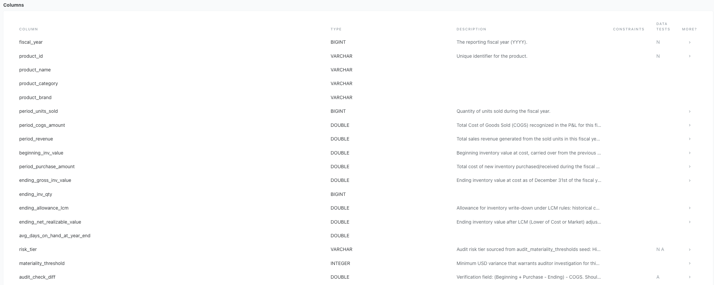
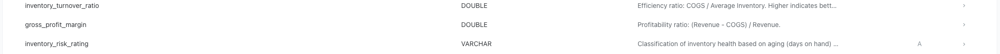
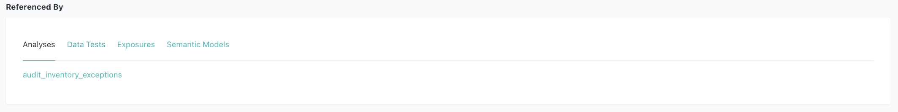
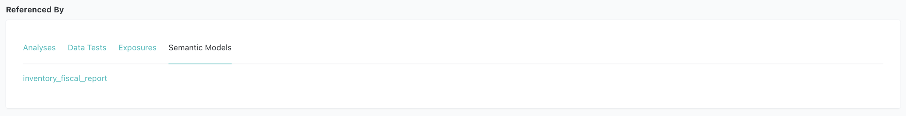
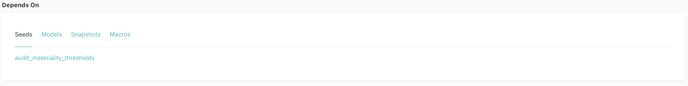
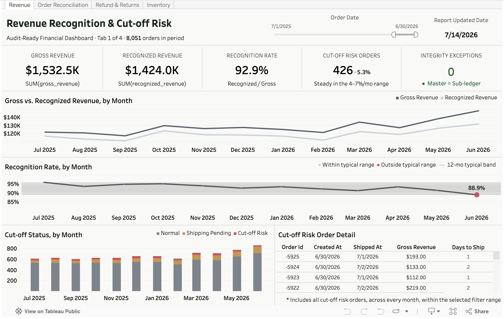
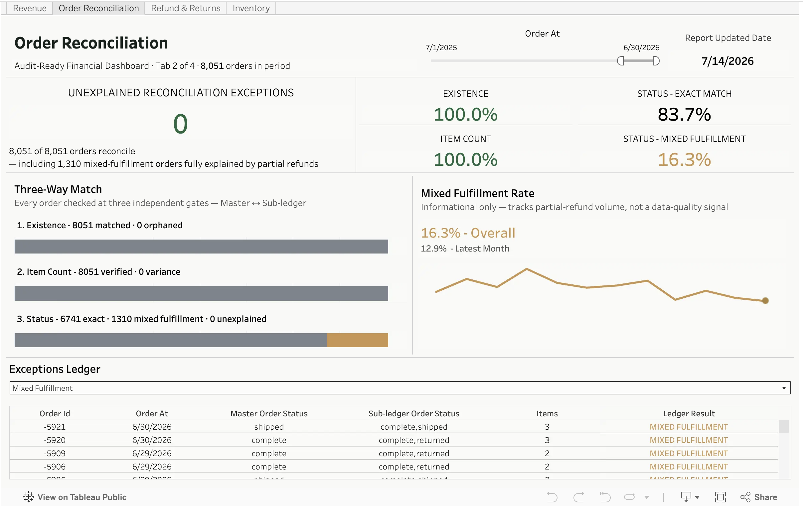
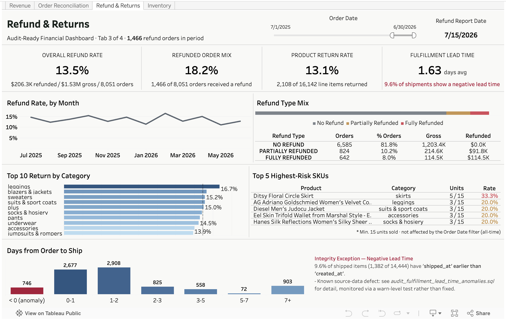
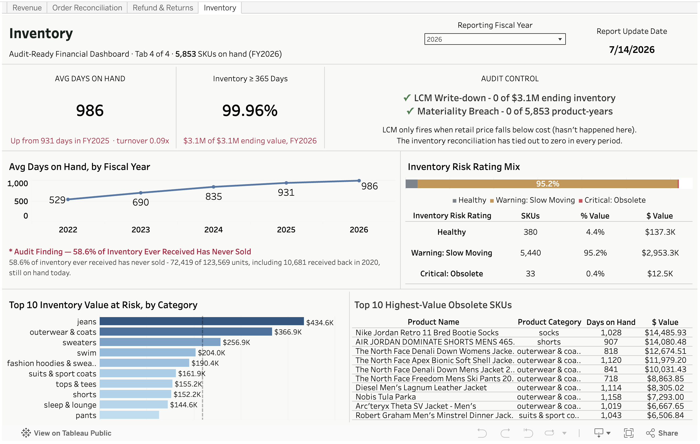

# Analytical Engineering Project
**Financial Data Pipeline & Reconciliation: E-commerce Case Study**
> **CPA's perspective on ensuring financial data integrity using the Modern Data Stack**

---

## 1. Project Overview

A portfolio project built by a **CPA (Big 4, Accounting Advisory Manager)** applying financial audit expertise to the modern data stack. The goal was to apply financial audit expertise directly to the modern data stack — not just build a pipeline, but embed the internal controls and reconciliation logic that a real audit would require.

* **Data Sources**:
  - [TheLook E-commerce](https://console.cloud.google.com/marketplace/product/bigquery-public-data/thelook-ecommerce) — a public BigQuery dataset simulating a fashion e-commerce business. `scripts/ingest_data.py` seeds from 1,000 random products, then pulls every order that touches them (plus each order's other line items) — snowballing via referential integrity to ~5.9K products / ~6.2K orders in the final extract.
  - Airflow-generated synthetic incremental data — daily orders (starting ~15/day and growing ~5%/month, continuing the BigQuery source's own growth trend past its ingestion cutoff) including partial refund scenarios (15%), injected via `scripts/generate_daily_incremental.py`
* **Objective**: Transform raw transactional logs into audit-ready financial marts with automated internal controls
* **Core Value**: Bridge the gap between system logs and GAAP/IFRS standards by embedding reconciliation logic, revenue recognition, and inventory valuation directly into the transformation layer

---

## 2. Tech Stack & Engineering Value
* **Stack**: SQL, Python, dbt-core, DuckDB, BigQuery, Apache Airflow, Docker, Parquet, MetricFlow, SQLFluff, Ruff.
* **Audit Trail**: Every model is documented with metadata to provide a clear path from raw data to final report — essential for financial audits.
* **Cost-Efficiency**: By developing against a **Python-to-DuckDB** local pipeline instead of iterating directly against BigQuery, development-time warehouse compute costs are close to zero — BigQuery is only touched once, at ingestion.
* **Idempotency**: Designed models to be idempotent, ensuring that re-running the pipeline produces consistent financial results without duplication.

---

## 3. Hybrid Data Architecture
I adopted a hybrid architecture to balance development efficiency with production scalability.

### 1. Ingestion & Synthetic Data Generation
* **Python Extraction** (📂 `scripts/ingest_data.py`): Extracts BigQuery raw data into local **Parquet** (`raw_*.parquet`) files via API.
* **Airflow Daily Simulation** (📂 `scripts/generate_daily_incremental.py`): Appends synthetic orders daily — starting at ~15/day and growing ~5%/month from the BigQuery ingestion cutoff, so the incremental layer continues that source's own growth trend instead of flatlining — including partial refund scenarios (15%) — to separate `incr_*.parquet` files, keeping the BigQuery source layer immutable. ~23% of orders start as genuinely unshipped (`Processing`) and are rolled forward on later runs (shipped, still pending, or aged out to `cancelled`), so recognized revenue and cut-off risk stay realistic instead of every order shipping within 48 hours.
* **Local Data Lake**:
    - `data/raw_*.parquet` (5 files, ~4 MB) — BigQuery-sourced, read-only. **Tracked in git** for reviewer convenience; regenerate via `scripts/ingest_data.py` if needed.
    - `data/incr_*.parquet` (3 files) — Airflow-generated daily incremental data. **Not tracked in git** (changes daily); initialize once via `scripts/generate_daily_incremental.py`, then updated automatically by the Airflow pipeline.
* **Seeds** (`seeds/`):
    - 📂 `seeds/audit_materiality_thresholds.csv` — CPA-defined audit risk tier and materiality threshold per product category (lookup table)

### 2. High-Performance Local Development
* **Engine**: Powered by **DuckDB**, optimized for **Apple Silicon** to enable rapid iteration with zero cloud costs.
* **Multi-Environment**: **dbt profiles** (`profiles.yml`) are configured to switch from local DuckDB to **BigQuery** with a single command.

### 3. Modular Transformation (dbt)

**Visualizing the Audit-Ready Data Pipeline**
* **Layered Architecture**: Implemented a 4-tier structure (Staging → Intermediate → Marts → Semantic Layer) to ensure data traceability.
* **Color-Coded Nodes**:
    -  Raw Sources: BigQuery thelook & Airflow incremental
    -  Seeds (lookup tables)
    -  Staging Layer - thelookecommerce
    -  Staging Layer - Incremental
    -  Intermediate Layer
    -  Financial Marts
    -  Snapshots (scd_products)
    -  Analyses
    -  Semantic Models (MetricFlow)
    -  MetricFlow Metrics
    -  Utilities
    -  Automated Data Quality Tests

#### Model Directory
* **Staging Layer** (`models/staging/thelook_ecommerce/`):
    - 📂 `stg_thelook_ecommerce__orders.sql`
    - 📂 `stg_thelook_ecommerce__order_items.sql`
    - 📂 `stg_thelook_ecommerce__products.sql`
    - 📂 `stg_thelook_ecommerce__users.sql`
    - 📂 `stg_thelook_ecommerce__inventory_items.sql`
    - 📂 `_thelook_ecommerce__sources.yml` — source definitions pointing to `raw_*.parquet`
    - 📂 `_thelook_ecommerce__models.yml` — consolidated model documentation

* **Staging Layer — Incremental** (`models/staging/incremental/`):
    - 📂 `stg_incremental__order_items.sql`
    - 📂 `stg_incremental__orders.sql`
    - 📂 `stg_incremental__inventory_items.sql`
    - 📂 `_incremental__sources.yml` — source definitions pointing to `incr_*.parquet`
    - 📂 `_incremental__models.yml` — consolidated model documentation

* **Intermediate Layer** (`models/intermediate/`):
  - **Orders** (`orders/`):
      - 📂 `int_order_items_unioned.sql`: UNION ALL of BigQuery-sourced and incremental order items at item grain. Shared base for `int_order_items_aggregated` and `order_item_revenue`.
      - 📂 `int_order_items_aggregated.sql`: Sub-ledger aggregation per `order_id` (item count, total amount, refund rollup).
      - 📂 `int_orders_joined.sql`: FULL JOIN of master ledger (`stg_orders`) and sub-ledger (`int_order_items_aggregated`). Shared base for `order_reconciliation` and `revenue` marts — eliminates duplicate join logic.
      - 📂 `_int_orders__models.yml` — consolidated model documentation
  - **Inventory** (`inventory/`):
      - 📂 `int_inventory_items_joined.sql`: Item-level lifecycle join (inbound ↔ outbound) with LCM valuation logic.
      - 📂 `int_inventory_items_unioned.sql`: UNION ALL of raw inventory receipts, one row per unit.
      - 📂 `_int_inventory__models.yml` — consolidated model documentation

* **Marts (Audit Layer)** (`models/marts/finance/`):
    - 📂 `order_reconciliation.sql`: Master-to-Subledger reconciliation, including a status-variance detail column that separates benign patterns (partial refund/shipment) from true anomalies.
    - 📂 `revenue.sql`: Accrual-based revenue recognition with cut-off risk detection.
    - 📂 `refund_reconciliation.sql`: Linking refunds to original orders.
    - 📂 `inventory_fiscal_report.sql`: Annual inventory valuation — COGS, LCM write-down, audit check, turnover ratios, and CPA-defined `risk_tier` / `materiality_threshold` per product category.
    - 📂 `order_item_revenue.sql`: Item-level revenue model (grain: one row per order item), including product category/brand/name. Enables status-level breakdown (`complete` / `returned` / `shipped` etc.) that is not possible at order grain — essential for partial refund scenarios where a single order contains items with different statuses.
    - 📂 `inventory_sellthrough.sql`: One row per physical inventory unit received, independent of order fulfillment status — answers "has this unit ever sold" directly.
    - 📂 `_finance__models.yml` — consolidated model documentation
    - 📂 `_finance__semantic_models.yml` — MetricFlow semantic model definitions
    - 📂 `_finance__metrics.yml` — business metric definitions

* **Utilities Layer** (`models/utilities/`):
    - 📂 `metricflow_time_spine.sql` — date spine table required by MetricFlow for time-based metric aggregation
    - 📂 `_utilities__models.yml` — consolidated model documentation

> **Materialization Strategy**:
> - **Staging**: `view` — zero storage cost, always reflects the latest source data.
> - **Intermediate**: `view` (not `ephemeral`) — dbt best practice suggests ephemeral for intermediate models to avoid creating unnecessary DB objects. This project deliberately uses views instead for two reasons:
>   1. `int_order_items_aggregated` is referenced by three downstream marts — ephemeral would inline and re-execute the same complex aggregation SQL three times;
>   2. intermediate models contain non-trivial join and aggregation logic that benefits from being directly queryable for debugging and validation.
> - **Marts**: `order_reconciliation`, `revenue`, `refund_reconciliation`, and `order_item_revenue` use **incremental models** (`merge` strategy) with a lookback window (`incremental_lookback_days`, default: 14 days) filtered on business timestamps (`created_at`, `shipped_at`, `returned_at`/`last_refund_at`) to catch late shipments and returns. Since that only re-scans *recent* timestamps, `dbt_run_marts` also runs `--full-refresh` on Sundays to catch backdated corrections older than the window. `inventory_fiscal_report` and `inventory_sellthrough` are plain full-refresh **tables** — cross-year LAG calculations and the pass-through sell-through view both need complete recalculation, not incremental merge.
> - **Utilities**: `table` — `metricflow_time_spine` is materialized as a static table since MetricFlow requires a pre-built date spine to perform time-based aggregations.

#### Jinja Macros
Repeated SQL expressions are extracted into reusable macros to enforce DRY principles and make business logic easier to maintain. Documented in 📂 `macros/_macros.yml`.

| Macro | Usage | Purpose |
|---|---|---|
| `fiscal_year_end(year_col)` | `inventory_fiscal_report` (×3) | Returns the fiscal year-end date (`YYYY-12-31`) as a `DATE`, capped at `current_date` so the year still in progress is evaluated as of today rather than a not-yet-elapsed December 31st |
| `datediff_days(start, end)` | `int_inventory_items_joined` (×2) | Calculates day difference between two date columns, used for inventory aging and velocity buckets |

```sql
-- Example: fiscal_year_end macro in use
LEFT JOIN {{ ref('scd_products') }} scd
    ON  l.product_id = scd.product_id
    AND {{ fiscal_year_end('y.fiscal_year') }} >= scd.dbt_valid_from
    AND (scd.dbt_valid_to IS NULL OR {{ fiscal_year_end('y.fiscal_year') }} < scd.dbt_valid_to)
```

### 4. Orchestration (Apache Airflow + Docker)
* **File**: 📂 `dags/dbt_incremental_pipeline.py`
* **Schedule**: Daily at 09:00 UTC, containerized via `docker-compose.yml`
* **Pipeline**:
    1. `generate_incremental_data` — Appends ~15 synthetic orders to `incr_*.parquet` — separate from the immutable BigQuery-sourced `raw_*.parquet`
    2. `dbt_seed` — Reloads `audit_materiality_thresholds` lookup table so threshold changes take effect without manual intervention
    3. `dbt_run_snapshot` — Refreshes `scd_products` SCD Type 2 snapshot to capture daily price/cost changes
    4. `dbt_run_intermediate` — Recreates all five intermediate views. Views already reflect current data on every query (no dbt run needed for freshness) — this step is a safety net that keeps view definitions in sync if a model's SQL changes.
    5. `dbt_run_marts` — Incremental merge into `order_reconciliation`, `revenue`, `refund_reconciliation`, `order_item_revenue` (full-refresh instead on Sundays, to catch backdated corrections the lookback window can't see); full-refresh rebuild of `inventory_fiscal_report` and `inventory_sellthrough` (plain table materializations — cross-year LAG logic and the unit-level sell-through view both need complete recalculation, not a partial merge)
    6. `dbt_test_incremental` — Runs tests on `stg_incremental__*`, intermediate, and mart models to validate pipeline output
    7. `export_for_tableau` — Exports all six mart tables to `tableau_exports/*.csv` for Tableau Public (overwrites on each run)

> **Note**: All 7 steps run sequentially (chained with `>>`) to avoid DuckDB write-lock contention — DuckDB allows only one writer at a time. `max_active_runs=1` additionally ensures no two DAG runs overlap.


*DAG list — `dbt_daily_incremental` active and scheduled daily at 09:00 UTC*


*Grid view — all 7 tasks completing successfully across daily runs (May–Jun)*

### 5. SCD Type 2 Snapshot (Product Price Tracking)
* **File**: 📂 `snapshots/scd_products.sql`
* **Strategy**: `check` — tracks row-level changes on `cost`, `retail_price`, `product_name`, `category` using `dbt snapshot`.
* **Purpose**: Maintains a full historical record of product price and category changes, enabling point-in-time inventory valuation and audit traceability without overwriting prior states.
* **Hard Delete Handling**: `invalidate_hard_deletes=True` ensures removed products are flagged rather than silently dropped from history.

### 6. Quality Control
* **Automated Reconciliation**: Custom dbt tests to flag financial discrepancies.

> The one `WARN` above is `assert_fulfillment_lead_time_within_baseline` — expected, not a failure. It's a warn-severity test that flags when the negative-lead-time rate (a known source-data defect, see below) rises well past its historical baseline. It's designed to warn rather than block the build, since the underlying defect can't be fixed at the transform layer.

    * **Model Schema Tests** (column-level constraints & descriptions):
        - 📂 `models/staging/thelook_ecommerce/_thelook_ecommerce__models.yml`
        - 📂 `models/staging/thelook_ecommerce/_thelook_ecommerce__sources.yml`
        - 📂 `models/staging/incremental/_incremental__models.yml`
        - 📂 `models/staging/incremental/_incremental__sources.yml`
        - 📂 `models/intermediate/inventory/_int_inventory__models.yml`
        - 📂 `models/intermediate/orders/_int_orders__models.yml`
        - 📂 `models/marts/finance/_finance__models.yml`
    
    * **Custom Assertion Tests** (business-logic validation):
        - 📂 `tests/assert_order_reconciliation_is_successful.sql`
        - 📂 `tests/assert_no_variance_in_order_recon.sql`
        - 📂 `tests/assert_revenue_recognition_logic.sql`
        - 📂 `tests/assert_fulfillment_lead_time_within_baseline.sql` — warns if the negative-lead-time rate rises well past its historical baseline
    
    * **Audit Exception Analyses** (`analyses/`) — ad-hoc audit queries compiled via `dbt compile`, using `{{ ref() }}` for table references. Copy the rendered SQL from `target/compiled/` to run directly against DuckDB:
        - 📂 `audit_inventory_exceptions.sql` — flags inventory equation imbalances (`audit_check_diff ≠ 0`), LCM write-down candidates, and slow-moving/obsolete stock
        - 📂 `audit_revenue_cutoff_risk.sql` — surfaces cut-off risk orders (created in one month, shipped in another) and pending shipments with unrecognized revenue
        - 📂 `audit_order_reconciliation_failures.sql` — lists orphan sub-ledger, missing sub-ledger, item count variances, and status mismatches between master and sub-ledger
        - 📂 `audit_refund_anomalies.sql` — detects partial refund patterns, high-value full reversals, and orders where refund exceeds 50% of gross revenue
        - 📂 `audit_fulfillment_lead_time_anomalies.sql` — flags items where `shipped_at` precedes `created_at`, a source-data defect traced to the raw feed
* **CI** (GitHub Actions — 📂 `.github/workflows/ci.yml`): SQLFluff lint and `dbt build` run automatically on every push and pull request to `main`.

### 7. SQL Code Quality (SQLFluff)
* **Linter**: [SQLFluff](https://sqlfluff.com/) — DuckDB dialect, dbt Jinja templater (📂 `.sqlfluff`). Enforces consistent formatting and explicit column qualification across all SQL models.

### 8. Python Code Quality (Ruff)
* **Linter & Formatter**: [Ruff](https://docs.astral.sh/ruff/) — configured in 📂 `pyproject.toml`.

### 9. YAML Code Quality (Prettier + dbt JSON Schema)
* **Formatter**: [Prettier](https://prettier.io/) — configured in 📂 `.prettierrc`. Run `npm install` to set up.
* **Schema Validation**: [dbt JSON Schema](https://github.com/dbt-labs/dbt-jsonschema) — validates dbt YAML structure in VS Code (📂 `.vscode/settings.json`).

### 10. Semantic Layer (MetricFlow)

Implemented a **dbt Semantic Layer** using MetricFlow to define standardized, reusable business metrics on top of the mart layer. This ensures metric definitions live in version-controlled code rather than scattered across BI tools.

#### Semantic Models & Metrics

| Semantic Model | Source Mart | Entity | Time Dimension |
|---|---|---|---|
| `revenue` | `revenue` | `order` | `created_at` (day) |
| `refund_reconciliation` | `refund_reconciliation` | `order` | `order_date` (day) |
| `inventory_fiscal_report` | `inventory_fiscal_report` | `product` | `fiscal_year_end_date` (year) |
| `order_item_revenue` | `order_item_revenue` | `order_item` | `created_at` (day) |
| `audit_materiality` | `audit_materiality_thresholds` | `product_category` | — (dimensional only) |

| Category | Metrics |
|---|---|
| Revenue | `total_recognized_revenue`, `total_gross_revenue`, `order_count`, `revenue_recognition_rate` |
| Refund | `total_refund_amount`, `total_net_revenue`, `refund_rate`, `refund_base_gross_revenue` |
| Inventory | `total_inventory_value`, `total_net_realizable_value`, `total_lcm_allowance`, `total_cogs`, `total_period_revenue`, `inventory_gross_profit` |
| Order Item | `total_item_gross_revenue`, `total_recognized_item_revenue`, `item_count`, `item_recognition_rate` |
| Cumulative | `cumulative_recognized_revenue`, `cumulative_gross_revenue`, `cumulative_refund_amount`, `cumulative_order_count` |
| MoM Growth | `revenue_growth_mom`, `gross_revenue_growth_mom`, `refund_rate_change_mom`, `item_revenue_growth_mom` |

#### Example Queries

```bash
# List all available metrics
mf list metrics

# List available dimensions for a metric
mf list dimensions --metrics total_gross_revenue

# Revenue metrics by month
mf query --metrics total_gross_revenue,total_recognized_revenue,order_count \
         --group-by metric_time__month

# Refund breakdown by refund type
mf query --metrics refund_rate,total_refund_amount,total_net_revenue \
         --group-by order__refund_type

# Inventory valuation by fiscal year and product category
mf query --metrics total_inventory_value,total_cogs,inventory_gross_profit \
         --group-by product__fiscal_year,product__product_category

# Item-level revenue breakdown by order item status (handles partial refund scenarios)
mf query --metrics total_recognized_item_revenue,total_item_gross_revenue \
         --group-by order_item__order_item_status

# Cumulative YTD recognized revenue by month (filter by year for period-end audit)
mf query --metrics cumulative_recognized_revenue \
         --group-by metric_time__month \
         --where "metric_time__day >= '2024-01-01' AND metric_time__day < '2025-01-01'"

# MoM growth metrics — revenue trend and refund rate anomaly detection
mf query --metrics revenue_growth_mom,gross_revenue_growth_mom --group-by metric_time__month
mf query --metrics refund_rate_change_mom --group-by metric_time__month
```

> **Note on `mf query` vs `dbt sl query`**: dbt's official documentation recommends `dbt sl query`, but this applies to the **dbt Cloud CLI** — a separate tool from dbt Core. In dbt Core, `dbt sl` is not available; MetricFlow is invoked directly via `mf query` (provided by the `dbt-metricflow` package). Both commands use the same MetricFlow engine underneath.

#### Architectural Note: Semantic Layer vs. Tableau

This project uses **dbt Core** (not dbt Cloud), which means the Semantic Layer cannot be directly wired into Tableau — that integration requires dbt Cloud's managed Semantic Layer endpoint.

As a result, the BI layer (Tableau Public) consumes mart tables via CSV exports — generated by `scripts/export_for_tableau.py` and refreshed automatically at the end of each Airflow DAG run — while the Semantic Layer serves two independent purposes:

> **Why CSV exports instead of a live DuckDB connection?** Tableau Public (the free tier) only supports file-based data sources and does not allow live database connections via JDBC/ODBC. A direct DuckDB connection would require Tableau Desktop (paid). The CSV export approach bridges this gap: Airflow keeps the files current, and Tableau Public loads them as static snapshots.

1. **Metric governance**: All business metric definitions (`revenue_recognition_rate`, `refund_rate`, etc.) are version-controlled in code rather than defined ad-hoc in dashboards.
2. **CLI demonstration**: `mf query` enables direct metric querying from the terminal, useful for ad-hoc analysis and verifying metric logic before surfacing in dashboards.

This also explains why the mart layer retains a **denormalized, purpose-built structure** (`revenue`, `order_reconciliation`, `refund_reconciliation` as separate tables) rather than consolidating into a single wide `orders` table. With dbt Cloud Semantic Layer handling the abstraction, normalized marts would be preferred — but for direct BI tool consumption, focused marts are more practical.

---

## 4. Financial Modeling & Accounting Logic
This project moves beyond simple ETL by embedding **Accounting Principles** into the data transformation layer to ensure audit-ready data reliability.

### 1. Financial Data Reconciliation (Master-to-Subledger)
* **File**: 📂 `models/marts/finance/order_reconciliation.sql`
* **Objective**: Ensure the completeness and accuracy of financial data by reconciling the Master table (Orders) with the Sub-ledger (Order Items).
* **Validation Logic**:
    - **Completeness**: Verified `order_id` matches across all layers to ensure no data loss.
    - **Accuracy**: Reconciled total item counts and order statuses between master records and granular transaction lines.
    - **Status Synchronization**: Validated **Order Status alignment** to detect any state-mismatch discrepancies between the header and line levels.
* **Audit Control**: Engineered an automated reconciliation layer that triggers an Audit Alert for any variance. This proactive control prevents downstream reporting errors and ensures the data is **"Audit-Ready"** for financial verification.

### 2. Revenue Recognition & Cut-off Management
* **File**: 📂 `models/marts/finance/revenue.sql`
* **Objective**: Implemented **Accrual Basis** accounting standards by designating `shipped_at` (fulfillment) as the primary trigger for revenue realization, ensuring compliance with **GAAP/IFRS** principles.
* **Complex Order State Management**:
    - Utilized `STRING_AGG(DISTINCT status)` (via `int_order_items_aggregated`, which `revenue.sql` builds on) to synchronize and monitor multiple item statuses within a single `order_id`.
    - Applied **COALESCE logic** to prevent data loss across the Full-Join between Master and Sub-ledger, maintaining a Single Source of Truth (SSOT).
* **Temporal Analysis & Cut-off Control**:
    - Engineered logic to analyze the time-lag between **Order Creation (`created_at`)** and **Fulfillment (`shipped_at`)**.
    - **Risk Mitigation**: Automated detection of **Potential Cut-off Risks** where revenue recognition spans different fiscal periods, preventing overstatement of monthly/yearly earnings.

### 3. Returns & Refund Reconciliation
* **File**: 📂 `models/marts/finance/refund_reconciliation.sql`
* **Objective**: Aggregates returned item amounts to `order_id` grain, moving away from treating refunds as isolated negative flows to provide a holistic view of the order lifecycle.
* **Revenue Reversal Integrity**: Ensured accurate **Net Revenue** calculation by accounting for historical reversals, eliminating the risk of overstated top-line metrics.
* **Audit Trail**: Created a `refund_type` classification (`NO REFUND` / `FULLY REFUNDED` / `PARTIALLY REFUNDED`) and `refund_value_rate` / `refund_count_rate` metrics to identify high-risk return patterns, providing transparency for stakeholders and internal auditors.

    - **Data Limitation (Acknowledged)**: The thelook_ecommerce BigQuery dataset synchronizes statuses at the order-header level — all items within a single `order_id` share the same status. As a result, **partial refund scenarios are structurally absent from the historical source data**. This is a known limitation of the dataset, not a pipeline issue.

    - **Solution — Ongoing Simulation via Airflow** (📂 `scripts/generate_daily_incremental.py`): The daily pipeline generates synthetic orders that include partial refund scenarios (15% probability — one item returned, another completed within the same `order_id`). These flow through a dedicated staging layer (`stg_incremental__*`) and UNION into the intermediate models alongside BigQuery data — ensuring partial refund detection logic is continuously exercised on incoming data.

    - **Logic Verification**: The reconciliation model correctly identifies 'PARTIALLY REFUNDED' cases and calculates precise `refund_count_rate` and `refund_value_rate` at `order_id` grain.

### 4. Financial Inventory Control & Valuation (Specific Identification)
* **File**: 📂 `models/marts/finance/inventory_fiscal_report.sql`
* **Methodology (Specific Identification & Cut-off)**: Implemented item-level cost tracking by following each `inventory_item_id` from inbound receipt to outbound sale — a **Specific Identification** approach that provides a granular audit trail and precise COGS calculation without the pooling assumptions of FIFO/LIFO.
* **Annual Reconciliation (Audit-Ready)**: Developed a fiscal-year snapshot engine that reconciles **Beginning Inventory + Purchases - Ending Inventory = COGS**.
* **Lower of Cost or Market (LCM)**: Engineered automated valuation logic that compares `historical_unit_cost` against the **period-end market price** sourced from the `scd_products` Type 2 snapshot (effective as of December 31st of each fiscal year). This ensures the LCM write-down reflects actual year-end market conditions — not the price frozen at inbound receipt — calculating the correct "Allowance for Inventory Valuation" for Balance Sheet reporting.
* **Inventory Aging & Velocity**: Developed an aging engine that buckets inventory into four categories (`<2yr` / `2–3yr` / `3–4yr` / `>4yr`). Combined this with **Inventory Turnover Ratios** at the product level to identify high-risk, slow-moving assets.
* **Audit Materiality by Category**: Joined 📂 `seeds/audit_materiality_thresholds.csv` — a CPA-defined lookup table assigning `risk_tier` (High / Medium / Low) and `materiality_threshold` ($10K / $5K / $2.5K) to each of the 26 product categories — directly into the mart. This exposes category-level audit priority alongside financial metrics, enabling threshold-based exception filtering without hardcoded values.
* **Data Integrity**: Applied rigorous dbt tests and intermediate-layer cleansing to enforce accounting principles, such as maintaining **chronological flow** (Inbound ≤ Outbound) and preventing negative inventory durations.
* **Unit-Level Sell-Through** (📂 `models/marts/finance/inventory_sellthrough.sql`): A separate, unaggregated mart — one row per physical unit received — built to answer a question `inventory_fiscal_report` can't: has this specific unit ever sold? Surfaced a real audit finding: 63% of units ever received have no sale event at all, including units received back in 2020 and still on hand today.

#### Model Detail: `inventory_fiscal_report` (Representative Example)
> The most complex mart in the project — wiring together a snapshot (point-in-time LCM pricing), a macro (fiscal year-end date), a seed (CPA-defined materiality thresholds), and multi-year LAG logic into a single audit-ready model. Used here to illustrate how dbt features and accounting principles converge in practice.

**Metadata & Governance**
Tags (`financial`, `audit_ready`), access level (`protected`), and model description ensure the model's purpose and governance are transparent for financial stakeholders.


**Accounting Logic Implementation**
21 columns covering the full inventory lifecycle — B/S metrics (`beginning_inv_value`, `ending_gross_inv_value`, `ending_allowance_lcm`, `ending_net_realizable_value`), P&L metrics (`period_cogs_amount`, `period_revenue`), audit fields (`audit_check_diff`, `risk_tier`, `materiality_threshold`), and financial ratios (`inventory_turnover_ratio`, `gross_profit_margin`).



**Automated Internal Controls & Downstream Usage**
7 dbt tests enforcing: `not_null` on `fiscal_year`, `product_id`, `risk_tier`; `accepted_values` on `audit_check_diff` (must be `0`), `inventory_risk_rating` (Healthy / Warning: Slow Moving / Critical: Obsolete / Adjustment Required: NRV < Cost), `risk_tier` (High / Medium / Low); and `unique_combination_of_columns` on `(fiscal_year, product_id)`.


Referenced downstream by `audit_inventory_exceptions.sql` (ad-hoc audit analysis) and the `inventory_fiscal_report` semantic model (MetricFlow) — the same tested mart feeds both the audit drill-down and governed metric definitions.



**Dependency Graph**
Depends on `int_inventory_items_joined` (model), `scd_products` (snapshot), `fiscal_year_end` (macro), and `audit_materiality_thresholds` (seed) — all four dbt node types wired into a single model.



### 5. Dashboard Showcase
A 4-tab Tableau workbook (`tableau_workbook/audit_ready_dbt_dashboard (desktop) .twb`, packaged as `(server).twbx`) consuming the CSV exports above — one tab per mart, each pairing KPI tiles with an audit-oriented drill-down, putting the accounting logic above into an actual audit view.

**[▶ View live on Tableau Public](https://public.tableau.com/app/profile/sam.park8167/viz/audit_ready_dbt_dashboard/Revenue)**

**① Revenue** — Gross vs. recognized revenue by month, with automated Potential Cut-off Risk detection when `shipped_at` falls in a different fiscal period than `created_at`.


**② Order Reconciliation** — Master-to-subledger status at a glance, splitting genuine reconciliation failures from benign variance patterns (partial refunds, mixed shipments) so only true exceptions surface.


**③ Refund & Returns** — Refund rate trend, product return rate by category, and a fulfillment lead-time integrity check that flags `shipped_at` timestamps recorded earlier than `created_at` — a defect traced back to the raw source data, monitored via a warn-severity dbt test rather than silently patched.


**④ Inventory** — LCM write-down and materiality-breach controls (both structurally clean), set against an Avg Days on Hand trend that's risen every year since FY2022 with no reversal — the real exposure is slow-moving stock, not mis-valued stock.


---

## 5. Getting Started

**Prerequisites**: Docker Desktop, Python 3.9+, Google Cloud account (free tier — thelook_ecommerce is a public dataset)

> **Note for reviewers**: `data/raw_*.parquet` (~4 MB, BigQuery source data) is included in this repository. **Steps 4–5 (BigQuery ingestion) can be skipped**. From Step 7, choose either manual execution or Airflow — `incr_*.parquet` files are excluded from git as they change daily.

### Step 1 — Clone the repository
```bash
git clone https://github.com/samshpark/audit_ready_dbt.git
cd audit_ready_dbt
```

### Step 2 — Create `profiles.yml`
`profiles.yml` is excluded from git. Create it manually in the project root:
```yaml
audit_ready_dbt:
  target: dev
  outputs:
    dev:
      type: duckdb
      path: dev.duckdb
    prod:
      type: bigquery
      method: service-account
      project: your-gcp-project-id
      dataset: audit_ready_dbt
      keyfile: credentials/google_creds.json
      threads: 4
      timeout_seconds: 300
      location: US
```

### Step 3 — Set up local Python environment
```bash
python3 -m venv venv
source venv/bin/activate
pip install dbt-duckdb dbt-bigquery dbt-metricflow google-cloud-bigquery pandas pyarrow
```
> `dbt-bigquery` is only required if you intend to run against the BigQuery `prod` target.

### Step 4 — Set up BigQuery credentials
- Create a [Google Cloud service account](https://console.cloud.google.com/iam-admin/serviceaccounts) with **BigQuery Data Viewer** and **BigQuery Job User** roles
- Download the JSON key and save it to `credentials/google_creds.json` (excluded from git)

### Step 5 — Ingest data from BigQuery *(optional — raw_*.parquet already in repo)*
```bash
# Only needed if you want to re-pull fresh data from BigQuery
python scripts/ingest_data.py
```

### Step 6 — Install dbt packages *(required)*
```bash
dbt deps
```

### Step 7 — Run the pipeline

From Step 7 onwards, you can either run the pipeline **manually** or let **Airflow** handle it.

#### Option A — Manual
```bash
python scripts/generate_daily_incremental.py  # initialize incr_*.parquet
dbt seed                                       # load audit_materiality_thresholds
dbt snapshot                                   # build scd_products price history
dbt run                                        # execute all models
dbt test                                       # validate all tests
python scripts/export_for_tableau.py           # export mart tables to tableau_exports/*.csv
```

#### Option B — Airflow
```bash
# Builds the Docker image and starts Postgres, webserver, and scheduler
docker-compose up -d

# Wait ~30 seconds for containers to become healthy, then verify
docker ps
```
Open **http://localhost:8080** and log in with `admin` / `admin`.
Enable the `dbt_daily_incremental` DAG — it runs automatically at 09:00 UTC daily, or trigger it manually from the UI.

The DAG handles `generate_daily_incremental.py → dbt seed → dbt snapshot → dbt run intermediate → dbt run marts → dbt test → export_for_tableau` on every run.

### Step 8 — Query metrics via Semantic Layer
```bash
# Validate semantic model definitions
mf validate-configs
```

See [Semantic Layer — Example Queries](#10-semantic-layer-metricflow) above for `mf query` usage.

### Step 9 — Browse dbt documentation *(optional)*
```bash
dbt docs generate
dbt docs serve
```
Open **http://localhost:8080** to explore model metadata, column descriptions, data tests, and the full dependency graph.
