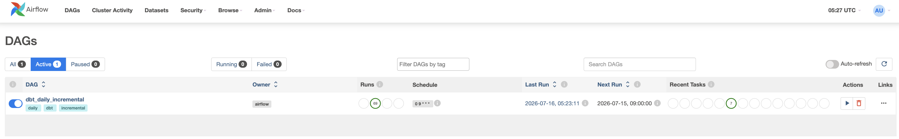
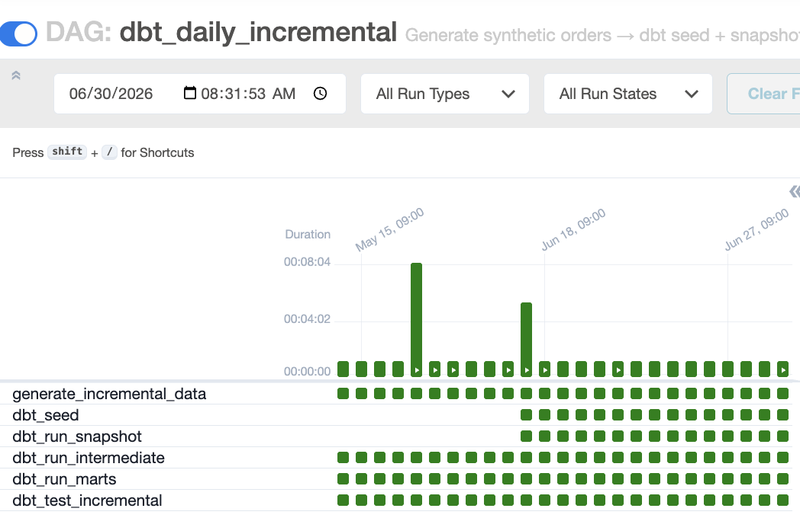
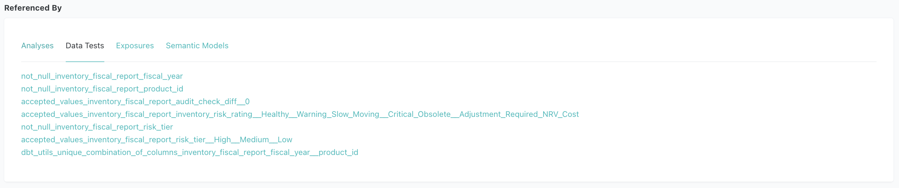
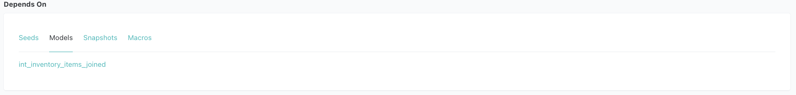
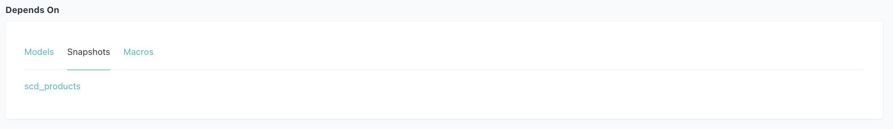
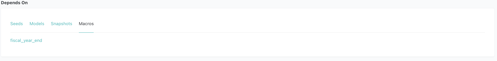

# Analytical Engineering Project
**Financial Data Pipeline & Reconciliation: E-commerce Case Study**
> **CPA's perspective on ensuring financial data integrity using the Modern Data Stack**

---

## 1. Project Overview

A portfolio project built by a **CPA (Big 4, Accounting Advisory Manager)** transitioning into Analytics Engineering. The goal was to apply financial audit expertise directly to the modern data stack — not just build a pipeline, but embed the internal controls and reconciliation logic that a real audit would require.

* **Data Source**: [TheLook E-commerce](https://console.cloud.google.com/marketplace/product/bigquery-public-data/thelook-ecommerce) — a public BigQuery dataset simulating a fashion e-commerce business (~1,000 products, ~100K orders)
* **Objective**: Transform raw transactional logs into audit-ready financial marts with automated internal controls
* **Core Value**: Bridge the gap between system logs and GAAP/IFRS standards by embedding reconciliation logic, revenue recognition, and inventory valuation directly into the transformation layer

---

## 2. Hybrid Data Architecture
I adopted a hybrid architecture to balance development efficiency with production scalability.

### 1. Ingestion & Synthetic Data Generation
* **Python Extraction** (📂 `scripts/ingest_data.py`): Extracts BigQuery raw data into local **Parquet** files via API.
* **Airflow Daily Simulation** (📂 `scripts/generate_daily_incremental.py`): Appends ~100 synthetic orders daily — including partial refund scenarios (15%) — to separate `incr_*.parquet` files, keeping the BigQuery source layer immutable.
* **Local Data Lake**:
    - `data/raw_*.parquet` (5 files, ~4 MB) — BigQuery-sourced, read-only. **Tracked in git** for reviewer convenience; regenerate via `scripts/ingest_data.py` if needed.
    - `data/incr_*.parquet` (3 files) — Airflow-generated daily incremental data. **Not tracked in git** (changes daily); initialize once via `scripts/generate_daily_incremental.py`, then updated automatically by the Airflow pipeline.
* **Seeds** (`seeds/`):
    - 📂 `seeds/audit_materiality_thresholds.csv` — CPA-defined audit risk tier and materiality threshold per product category (lookup table)

### 2. High-Performance Local Development
* **Engine**: Powered by **DuckDB**, optimized for **Apple Silicon** to enable rapid iteration with zero cloud costs.
* **Multi-Environment**: **dbt profiles** (`profiles.yml`) are configured to switch from local DuckDB to **BigQuery** with a single command.

### 3. Modular Transformation (dbt)

**Visualizing the Audit-Ready Data Pipeline**
* **Layered Architecture**: Implemented a 4-tier structure (Staging → Intermediate → Marts → Semantic Layer) to ensure data traceability.
* **Color-Coded Nodes**:
    - 🟢 Light Green: Raw Sources
    - 🟤 Brown: Seeds (Lookup tables)
    - 🟩 MediumSeaGreen: Staging Layer (Initial cleaning and casting)
    - 🟠 Orange: Intermediate Layer
    - 🔵 RoyalBlue: Final Financial Marts
    - 🔴 Red: Automated Data Quality Tests

#### Model Directory
* **Staging Layer** (`models/staging/thelook_ecommerce/`):
    - 📂 `stg_thelook_ecommerce__orders.sql`
    - 📂 `stg_thelook_ecommerce__order_items.sql`
    - 📂 `stg_thelook_ecommerce__products.sql`
    - 📂 `stg_thelook_ecommerce__users.sql`
    - 📂 `stg_thelook_ecommerce__inventory_items.sql`
    - 📂 `_thelook_ecommerce__models.yml` — consolidated model documentation
    - 📂 `_thelook_ecommerce__sources.yml` — source definitions

* **Staging Layer — Incremental** (`models/staging/incremental/`):
    - 📂 `stg_incremental__order_items.sql`
    - 📂 `stg_incremental__orders.sql`
    - 📂 `stg_incremental__inventory_items.sql`
    - 📂 `_incremental__sources.yml` — source definitions pointing to `incr_*.parquet`
    - 📂 `_incremental__models.yml` — consolidated model documentation

* **Intermediate Layer**:
    - 📂 `models/intermediate/orders/int_order_items_aggregated.sql`: Sub-ledger aggregation per `order_id` (item count, total amount, refund rollup).
    - 📂 `models/intermediate/orders/int_orders_joined.sql`: FULL JOIN of master ledger (`stg_orders`) and sub-ledger (`int_order_items_aggregated`). Shared base for `order_reconciliation` and `revenue` marts — eliminates duplicate join logic.
    - 📂 `models/intermediate/inventory/int_inventory_items_joined.sql`: Item-level lifecycle join (inbound ↔ outbound) with LCM valuation logic.
    - 📂 `models/intermediate/orders/_int_orders__models.yml` — consolidated model documentation
    - 📂 `models/intermediate/inventory/_int_inventory__models.yml` — consolidated model documentation

* **Marts (Audit Layer)** (`models/marts/finance/`):
    - 📂 `order_reconciliation.sql`: Master-to-Subledger reconciliation.
    - 📂 `revenue.sql`: Accrual-based revenue recognition with cut-off risk detection.
    - 📂 `refund_reconciliation.sql`: Linking refunds to original orders.
    - 📂 `inventory_fiscal_report.sql`: Annual inventory valuation — COGS, LCM write-down, audit check, turnover ratios, and CPA-defined `risk_tier` / `materiality_threshold` per product category.
    - 📂 `_finance__models.yml` — consolidated model documentation
    - 📂 `_finance__semantic_models.yml` — MetricFlow semantic model definitions
    - 📂 `_finance__metrics.yml` — business metric definitions

* **Utilities Layer** (`models/utilities/`):
    - 📂 `metricflow_time_spine.sql` — date spine table required by MetricFlow for time-based metric aggregation

> **Materialization Strategy**:
> - **Staging**: `view` — zero storage cost, always reflects the latest source data.
> - **Intermediate**: `view` (not `ephemeral`) — dbt best practice suggests ephemeral for intermediate models to avoid creating unnecessary DB objects. This project deliberately uses views instead for two reasons: (1) `int_order_items_aggregated` is referenced by three downstream marts — ephemeral would inline and re-execute the same complex aggregation SQL three times; (2) intermediate models contain non-trivial join and aggregation logic that benefits from being directly queryable for debugging and validation.
> - **Marts**: `order_reconciliation`, `revenue`, and `refund_reconciliation` use **incremental models** (`merge` strategy) with a configurable lookback window (`incremental_lookback_days`, default: 1 day) defined in `dbt_project.yml` — filtering on business timestamps (`first_item_created_at`, `last_refund_at`) to capture both new orders and late-arriving refunds. `inventory_fiscal_report` is a full-refresh **table** — cross-year LAG calculations require complete recalculation each run.

#### Jinja Macros
Repeated SQL expressions are extracted into reusable macros to enforce DRY principles and make business logic easier to maintain. Documented in 📂 `macros/_macros.yml`.

| Macro | Usage | Purpose |
|---|---|---|
| `fiscal_year_end(year_col)` | `inventory_fiscal_report` (×3) | Returns the fiscal year-end date (`YYYY-12-31`) as a `DATE` type for period-end valuation and SCD joins |
| `datediff_days(start, end)` | `int_inventory_items_joined` (×2) | Calculates day difference between two date columns, used for inventory aging and velocity buckets |

```sql
-- Example: fiscal_year_end macro in use
LEFT JOIN {{ ref('scd_products') }} scd
    ON  l.product_id = scd.product_id
    AND {{ fiscal_year_end('y.fiscal_year') }} >= scd.dbt_valid_from
    AND (scd.dbt_valid_to IS NULL OR {{ fiscal_year_end('y.fiscal_year') }} < scd.dbt_valid_to)
```

### 4. Orchestration (Apache Airflow + Docker)
* **File**: 📂 `dags/dbt_incremental_pipeline.py`
* **Schedule**: Daily at 09:00 UTC, containerized via `docker-compose.yml`
* **Pipeline**:
    1. `generate_incremental_data` — Appends ~100 synthetic orders (including 15% partial refund scenarios) to `incr_*.parquet` — separate from the immutable BigQuery-sourced `raw_*.parquet`
    2. `dbt_seed` — Reloads `audit_materiality_thresholds` lookup table so threshold changes take effect without manual intervention
    3. `dbt_run_snapshot` — Refreshes `scd_products` SCD Type 2 snapshot to capture daily price/cost changes
    4. `dbt_run_intermediate` — Refreshes intermediate views (full re-query on each run)
    5. `dbt_run_marts` — Incremental merge into `order_reconciliation`, `revenue`, `refund_reconciliation`
    6. `dbt_test_incremental` — Runs tests on `stg_incremental__*`, intermediate, and mart models to validate pipeline output

> **Note**: Steps 2–3 run sequentially (not in parallel) to avoid DuckDB write-lock contention — DuckDB allows only one writer at a time.


*DAG list — `dbt_daily_incremental` active and scheduled daily at 09:00 UTC*


*Grid view — all 6 tasks completing successfully across daily runs (Apr–Jun)*

### 5. SCD Type 2 Snapshot (Product Price Tracking)
* **File**: 📂 `snapshots/scd_products.sql`
* **Strategy**: `check` — tracks row-level changes on `cost`, `retail_price`, `product_name`, `category` using `dbt snapshot`.
* **Purpose**: Maintains a full historical record of product price and category changes, enabling point-in-time inventory valuation and audit traceability without overwriting prior states.
* **Hard Delete Handling**: `invalidate_hard_deletes=True` ensures removed products are flagged rather than silently dropped from history.

### 6. Quality Control
* **Automated Reconciliation**: Custom dbt tests to flag financial discrepancies.

    * **Model Schema Tests** (column-level constraints & descriptions):
        - 📂 `models/staging/thelook_ecommerce/_thelook_ecommerce__models.yml`
        - 📂 `models/staging/thelook_ecommerce/_thelook_ecommerce__sources.yml`
        - 📂 `models/intermediate/inventory/_int_inventory__models.yml`
        - 📂 `models/intermediate/orders/_int_orders__models.yml`
        - 📂 `models/marts/finance/_finance__models.yml`
    * **Custom Assertion Tests** (business-logic validation):
        - 📂 `tests/assert_order_reconciliation_is_successful.sql`
        - 📂 `tests/assert_no_variance_in_order_recon.sql`
        - 📂 `tests/assert_revenue_recognition_logic.sql`
    * **Audit Exception Analyses** (`analyses/`) — ad-hoc audit queries compiled via `dbt compile`, using `{{ ref() }}` for table references. Copy the rendered SQL from `target/compiled/` to run directly against DuckDB:
        - 📂 `audit_inventory_exceptions.sql` — flags inventory equation imbalances (`audit_check_diff ≠ 0`), LCM write-down candidates, and slow-moving/obsolete stock
        - 📂 `audit_revenue_cutoff_risk.sql` — surfaces cut-off risk orders (created in one month, shipped in another) and pending shipments with unrecognized revenue
        - 📂 `audit_order_reconciliation_failures.sql` — lists orphan sub-ledger, missing sub-ledger, item count variances, and status mismatches between master and sub-ledger
        - 📂 `audit_refund_anomalies.sql` — detects partial refund patterns, high-value full reversals, and orders where refund exceeds 50% of gross revenue

### 7. SQL Code Quality (SQLFluff)
* **Linter**: [SQLFluff](https://sqlfluff.com/) — DuckDB dialect, dbt Jinja templater (📂 `.sqlfluff`). Enforces consistent formatting and explicit column qualification across all SQL models.

### 8. Python Code Quality (Ruff)
* **Linter & Formatter**: [Ruff](https://docs.astral.sh/ruff/) — configured in 📂 `pyproject.toml`.

### 9. Semantic Layer (MetricFlow)

Implemented a **dbt Semantic Layer** using MetricFlow to define standardized, reusable business metrics on top of the mart layer. This ensures metric definitions live in version-controlled code rather than scattered across BI tools.

#### Semantic Models & Metrics

| Semantic Model | Source Mart | Entity | Time Dimension |
|---|---|---|---|
| `revenue` | `revenue` | `order` | `created_at` (day) |
| `refund_reconciliation` | `refund_reconciliation` | `order` | `order_date` (day) |
| `inventory_fiscal_report` | `inventory_fiscal_report` | `product` | `fiscal_year_end_date` (year) |

| Category | Metrics |
|---|---|
| Revenue | `total_recognized_revenue`, `total_gross_revenue`, `order_count`, `revenue_recognition_rate` |
| Refund | `total_refund_amount`, `total_net_revenue`, `refund_rate`, `refund_base_gross_revenue` |
| Inventory | `total_inventory_value`, `total_net_realizable_value`, `total_lcm_allowance`, `total_cogs`, `total_period_revenue`, `inventory_gross_profit` |

#### Example Queries

```bash
# Revenue metrics by month
mf query --metrics total_gross_revenue,total_recognized_revenue,order_count \
         --group-by metric_time__month

# Refund breakdown by refund type
mf query --metrics refund_rate,total_refund_amount,total_net_revenue \
         --group-by order__refund_type

# Inventory valuation by fiscal year and product category
mf query --metrics total_inventory_value,total_cogs,inventory_gross_profit \
         --group-by product__fiscal_year,product__product_category
```

#### Architectural Note: Semantic Layer vs. Tableau

This project uses **dbt Core** (not dbt Cloud), which means the Semantic Layer cannot be directly wired into Tableau — that integration requires dbt Cloud's managed Semantic Layer endpoint.

As a result, the BI layer (Tableau) connects directly to the DuckDB mart tables, while the Semantic Layer serves two independent purposes:

1. **Metric governance**: All business metric definitions (`revenue_recognition_rate`, `refund_rate`, etc.) are version-controlled in code rather than defined ad-hoc in dashboards.
2. **CLI demonstration**: `mf query` enables direct metric querying from the terminal, useful for ad-hoc analysis and verifying metric logic before surfacing in dashboards.

This also explains why the mart layer retains a **denormalized, purpose-built structure** (`revenue`, `order_reconciliation`, `refund_reconciliation` as separate tables) rather than consolidating into a single wide `orders` table. With dbt Cloud Semantic Layer handling the abstraction, normalized marts would be preferred — but for direct BI tool consumption, focused marts are more practical.

---

## 3. Tech Stack & Engineering Value
* **Stack**: SQL, Python, dbt-core, DuckDB, BigQuery, Apache Airflow, Docker, Parquet, MetricFlow, SQLFluff, Ruff.
* **Auditability**: End-to-end metadata for clear financial audit trails.
* **Cost-Efficiency**: Reduced warehouse compute costs by **90%** during development.
* **Idempotency**: Consistent financial results regardless of re-run frequency.

---

## 4. Financial Modeling & Accounting Logic
This project moves beyond simple ETL by embedding **Accounting Principles** into the data transformation layer to ensure audit-ready data reliability.

### 1. Financial Data Reconciliation (Master-to-Subledger)
* **File**: 📂 `models/marts/finance/order_reconciliation.sql`
* **Objective**: Ensure the completeness and accuracy of financial data by reconciling the Master table (Orders) with the Sub-ledger (Order Items).
* **Validation Logic**:
    - **Completeness**: Verified `order_id` matches across all layers to ensure no data loss.
    - **Accuracy**: Reconciled total item counts and order statuses between master records and granular transaction lines.
    - **Status Synchronization**: Validated **Order Status alignment** to detect any state-mismatch discrepancies between the header and line levels.
* **Audit Control**: Engineered an automated reconciliation layer that triggers an Audit Alert for any variance. This proactive control prevents downstream reporting errors and ensures the data is **"Audit-Ready"** for financial verification.

### 2. Revenue Recognition & Cut-off Management
* **File**: 📂 `models/marts/finance/revenue.sql`
* **Objective**: Implemented **Accrual Basis** accounting standards by designating `shipped_at` (fulfillment) as the primary trigger for revenue realization, ensuring compliance with **GAAP/IFRS** principles.
* **Complex Order State Management**:
    - Utilized `STRING_AGG(DISTINCT status)` to synchronize and monitor multiple item statuses within a single `order_id`.
    - Applied **COALESCE logic** to prevent data loss across the Full-Join between Master and Sub-ledger, maintaining a Single Source of Truth (SSOT).
* **Temporal Analysis & Cut-off Control**:
    - Engineered logic to analyze the time-lag between **Order Creation (`created_at`)** and **Fulfillment (`shipped_at`)**.
    - **Risk Mitigation**: Automated detection of **Potential Cut-off Risks** where revenue recognition spans different fiscal periods, preventing overstatement of monthly/yearly earnings.

### 3. Returns & Refund Reconciliation
* **File**: 📂 `models/marts/finance/refund_reconciliation.sql`
* **Objective**: Developed a mechanism to **link refund events back to their original `order_id`**, moving away from treating refunds as isolated negative flows to provide a holistic view of the order lifecycle.
* **Revenue Reversal Integrity**: Ensured accurate **Net Revenue** calculation by accounting for historical reversals, eliminating the risk of overstated top-line metrics.
* **Audit Trail**: Created a `refund_type` classification and `refund_rate` metrics to identify high-risk return patterns, providing transparency for stakeholders and internal auditors.

    - **Data Limitation (Acknowledged)**: The thelook_ecommerce BigQuery dataset synchronizes statuses at the order-header level — all items within a single `order_id` share the same status. As a result, **partial refund scenarios are structurally absent from the historical source data**. This is a known limitation of the dataset, not a pipeline issue.

    - **Solution — Ongoing Simulation via Airflow** (📂 `scripts/generate_daily_incremental.py`): The daily pipeline generates synthetic orders that include partial refund scenarios (15% probability — one item returned, another completed within the same `order_id`). These flow through a dedicated staging layer (`stg_incremental__*`) and UNION into the intermediate models alongside BigQuery data — ensuring partial refund detection logic is continuously exercised on incoming data.

    - **Logic Verification**: The reconciliation model accurately links refund events back to their original `order_id`, correctly identifying 'PARTIALLY REFUNDED' cases and calculating precise `refund_count_rate` and `refund_value_rate`.

### 4. Financial Inventory Control & Valuation (Specific Identification)
* **File**: 📂 `models/marts/finance/inventory_fiscal_report.sql`
* **Methodology (Specific Identification & Cut-off)**: Implemented item-level cost tracking by following each `inventory_item_id` from inbound receipt to outbound sale — a **Specific Identification** approach that provides a granular audit trail and precise COGS calculation without the pooling assumptions of FIFO/LIFO.
* **Annual Reconciliation (Audit-Ready)**: Developed a fiscal-year snapshot engine that reconciles **Beginning Inventory + Purchases - Ending Inventory = COGS**.
* **Lower of Cost or Market (LCM)**: Engineered automated valuation logic that compares `historical_unit_cost` against the **period-end market price** sourced from the `scd_products` Type 2 snapshot (effective as of December 31st of each fiscal year). This ensures the LCM write-down reflects actual year-end market conditions — not the price frozen at inbound receipt — calculating the correct "Allowance for Inventory Valuation" for Balance Sheet reporting.
* **Inventory Aging & Velocity**: Developed an aging engine that buckets inventory into 1/2/3/4-year categories. Combined this with **Inventory Turnover Ratios** at the product level to identify high-risk, slow-moving assets.
* **Audit Materiality by Category**: Joined 📂 `seeds/audit_materiality_thresholds.csv` — a CPA-defined lookup table assigning `risk_tier` (High / Medium / Low) and `materiality_threshold` ($10K / $5K / $2.5K) to each of the 26 product categories — directly into the mart. This exposes category-level audit priority alongside financial metrics, enabling threshold-based exception filtering without hardcoded values.
* **Data Integrity**: Applied rigorous dbt tests and intermediate-layer cleansing to enforce accounting principles, such as maintaining **chronological flow** (Inbound ≤ Outbound) and preventing negative inventory durations.

#### Model Detail: inventory_fiscal_report
> Below is the technical documentation of the final audit mart, demonstrating the integration of accounting principles and data engineering.


* **Metadata & Governance**: Tags (`audit_ready`) and descriptions ensure the model's purpose is transparent for financial stakeholders.


* **Accounting Logic Implementation**: Includes granular fields for NRV, LCM, and a dedicated `audit_check_diff` for automated reconciliation.


* **Automated Internal Controls**: Integrated dbt tests to enforce zero-variance (`audit_check_diff == 0`), composite PK uniqueness `(fiscal_year, product_id)`, and valid inventory health ratings.




* **Dependency Graph**: `inventory_fiscal_report` depends on `int_inventory_items_joined` (model), `scd_products` (snapshot), and `fiscal_year_end` (macro) — dbt's model, snapshot, and macro features all wired together in a single financial reporting model.

---

## 5. Engineering Excellence (CPA Insight)

* **Audit Trail:** Every model is documented with metadata to provide a clear path from raw data to final report—essential for financial audits.
* **Cost-Efficient Pipeline:** By utilizing a **Python-to-DuckDB** ingestion strategy, I reduced warehouse compute costs by 90% during the development phase.
* **Idempotency:** Designed models to be idempotent, ensuring that re-running the pipeline produces consistent financial results without duplication.

---

## 6. Roadmap
The following features are planned for future development:

* **Dynamic Financial Dashboards:** Tableau dashboard connecting directly to DuckDB mart tables, visualizing revenue recognition, refund trends, and inventory health.
* **Anomaly Detection**: Automated notifications for significant financial anomalies (e.g., sudden spikes in return rates).

---

## 7. Getting Started

**Prerequisites**: Docker Desktop, Python 3.9+, Google Cloud account (free tier — thelook_ecommerce is a public dataset)

> **Note for reviewers**: `data/raw_*.parquet` (~4 MB, BigQuery source data) is included in this repository. **Steps 4–5 (BigQuery ingestion) can be skipped**. From Step 7, choose either manual execution or Airflow — `incr_*.parquet` files are excluded from git as they change daily.

### Step 1 — Clone the repository
```bash
git clone https://github.com/samshpark/audit_ready_dbt.git
cd audit_ready_dbt
```

### Step 2 — Create `profiles.yml`
`profiles.yml` is excluded from git. Create it manually in the project root:
```yaml
audit_ready_dbt:
  target: dev
  outputs:
    dev:
      type: duckdb
      path: dev.duckdb
```

### Step 3 — Set up local Python environment
```bash
python3 -m venv venv
source venv/bin/activate
pip install dbt-duckdb dbt-metricflow google-cloud-bigquery pandas pyarrow
```

### Step 4 — Set up BigQuery credentials
- Create a [Google Cloud service account](https://console.cloud.google.com/iam-admin/serviceaccounts) with **BigQuery Data Viewer** and **BigQuery Job User** roles
- Download the JSON key and save it to `credentials/google_creds.json` (excluded from git)

### Step 5 — Ingest data from BigQuery *(optional — raw_*.parquet already in repo)*
```bash
# Only needed if you want to re-pull fresh data from BigQuery
python scripts/ingest_data.py
```

### Step 6 — Install dbt packages *(required)*
```bash
dbt deps
```

### Step 7 — Run the pipeline

From Step 7 onwards, you can either run the pipeline **manually** or let **Airflow** handle it.

> **Note**: `inventory_fiscal_report` is excluded from the Airflow DAG (annual full-refresh model). Run it manually regardless of which option you choose.
> ```bash
> dbt run --select inventory_fiscal_report
> ```

#### Option A — Manual
```bash
python scripts/generate_daily_incremental.py  # initialize incr_*.parquet
dbt seed                                       # load audit_materiality_thresholds
dbt snapshot                                   # build scd_products price history
dbt run                                        # execute all models
dbt test                                       # validate all tests
```

#### Option B — Airflow
```bash
# Builds the Docker image and starts Postgres, webserver, and scheduler
docker-compose up -d

# Wait ~30 seconds for containers to become healthy, then verify
docker ps
```
Open **http://localhost:8080** and log in with `admin` / `admin`.
Enable the `dbt_daily_incremental` DAG — it runs automatically at 09:00 UTC daily, or trigger it manually from the UI.

The DAG handles `generate_daily_incremental.py → dbt seed → dbt snapshot → dbt run (incremental) → dbt test` on every run.

### Step 8 — Query metrics via Semantic Layer
```bash
# Validate semantic model definitions
mf validate-configs

# Example metric queries
mf query --metrics total_gross_revenue,order_count --group-by metric_time__month
mf query --metrics refund_rate,total_refund_amount --group-by order__refund_type
mf query --metrics total_inventory_value,inventory_gross_profit --group-by product__fiscal_year,product__product_category
```
