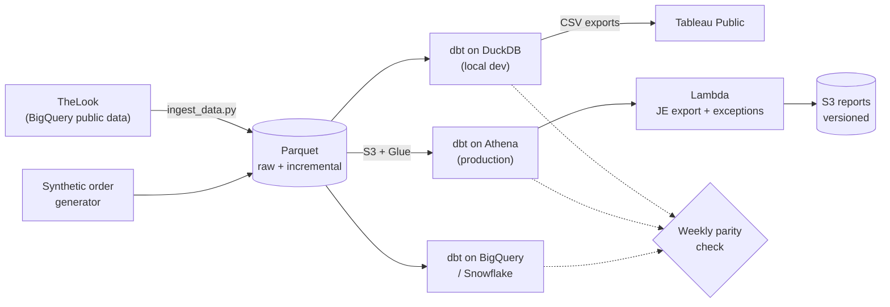
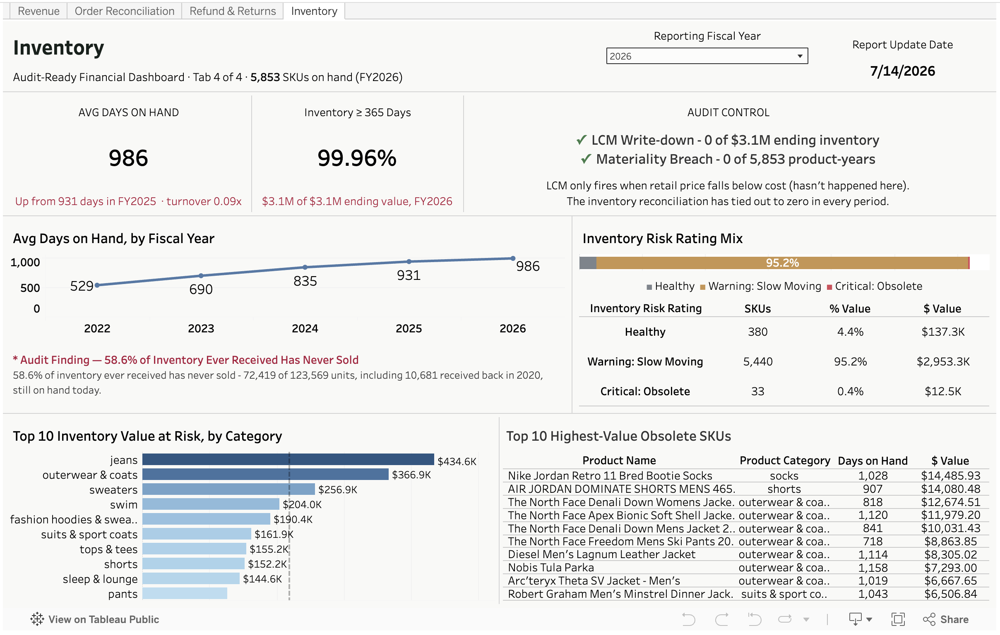

# Audit-Ready dbt: Analytics Engineering Project

A financial data pipeline built by a **CPA (Big 4, Accounting Advisory Manager)** that embeds the internal controls and reconciliation logic financial reporting depends on — revenue recognition, sub-ledger reconciliation, inventory valuation, and a balanced general ledger — directly into the dbt transformation layer.

**Data**: a referentially intact extract of the public [TheLook E-commerce](https://console.cloud.google.com/marketplace/product/bigquery-public-data/thelook-ecommerce) BigQuery dataset (~6.2K orders), extended daily by a synthetic-order generator that adds partial refunds, order backlogs, and returns — recording each event only once it has happened.


**[▶ Live dashboards on Tableau Public](https://public.tableau.com/app/profile/sam.park8167/viz/audit_ready_dbt_dashboard/Revenue)**

## Architecture


```mermaid
flowchart LR
    TL["TheLook<br/>(BigQuery public data)"] -->|ingest_data.py| PQ[("Parquet<br/>raw + incremental")]
    GEN["Synthetic order<br/>generator"] --> PQ
    PQ --> DUCK["dbt on DuckDB<br/>(local dev)"]
    PQ -->|"S3 + Glue"| ATH["dbt on Athena<br/>(production)"]
    PQ --> BQ["dbt on BigQuery<br/>/ Snowflake"]
    DUCK -->|CSV exports| TAB["Tableau Public"]
    ATH --> LAM["Lambda<br/>JE export + exceptions"]
    LAM --> RPT[("S3 reports<br/>versioned")]
    DUCK -.-> PAR{"Weekly parity<br/>check"}
    ATH -.-> PAR
    BQ -.-> PAR
```

Airflow orchestrates generation, the DuckDB and Athena builds, and the Lambda call daily, plus the parity check weekly. → [Architecture in detail](docs/architecture.md)


---

## Key Design Decisions

1. **dbt owns the accounting; the GL is derived, never re-derived.** `journal_entries` posts revenue, returns, and COGS from the marts that own each recognition rule. Tests enforce debit = credit and tie posted totals back to independently built marts on every build.
2. **Portable SQL, proven to the cent.** The same models build on DuckDB, BigQuery, Snowflake, and AWS Athena through dbt's cross-database macros. A weekly Airflow DAG rebuilds three warehouses from identical sources and compares ten GL and mart totals; its first run caught two DuckDB-only defects the test suites had missed.
3. **Preventive over detective controls.** An error-severity test fails the build on any future-dated shipment or return, so nothing is posted — added after the exception pipeline caught revenue being recognized ahead of shipment.
4. **Local-first, incremental, CI-gated.** DuckDB keeps development cost near zero; incremental marts merge with a 14-day lookback plus a Sunday full refresh. 199 data tests — seven of them singular tests for accounting controls such as sub-ledger reconciliation, revenue recognition, and double-entry balance — run on every build, and Slim CI builds and tests only changed models.
5. **AWS as the integration layer.** A SAM-deployed Lambda exports each day's entries and exceptions to a versioned S3 bucket — a point-in-time record the marts can't provide — with least-privilege IAM and separate deploy and run users.
6. **Deliberate departures from defaults.** Intermediate models are views, not the ephemeral models dbt recommends, because `int_order_items_aggregated` feeds three marts — ephemeral would re-run that aggregation three times — and views stay queryable for debugging. The Airflow DuckDB steps run strictly in sequence because DuckDB allows only one writer at a time.
7. **Governed metrics and lineage to the dashboard.** 26 business metrics are defined once in MetricFlow rather than inside dashboards, and each of the four Tableau dashboards is declared as a dbt exposure, so the lineage graph shows which dashboard a mart change would break before it ships.

## Accounting Logic

Eight marts in `models/marts/finance/`:

**Orders & revenue**
- **Order reconciliation** (`order_reconciliation`) — Reconciles master orders to the item sub-ledger on completeness, item counts, and status, separating explained variances (partial refunds and shipments) from true breaks.
- **Revenue recognition & cut-off** (`revenue`) — Accrual basis with shipment as the trigger (ASC 606 control transfer, FOB shipping point). Orders created and shipped in different periods are flagged as cut-off risk. Returns are posted when they occur; estimating a refund liability at the point of sale, as strict ASC 606 would, is noted as out of scope.
- **Item-level revenue** (`order_item_revenue`) — One row per order item, for the status-level breakdown (`complete` / `returned` / `shipped`) that order grain can't show when one order is partly refunded.
- **Refund reconciliation** (`refund_reconciliation`) — Rolls returns up to the order to compute net revenue and classify each order as no, partial, or full refund. Partial refunds come from synthetic data, since the source syncs item statuses at the order level.

**Inventory**
- **Inventory valuation** (`inventory_fiscal_report`) — Specific identification per unit, an annual roll-forward (beginning + purchases − ending = COGS), lower-of-cost-or-market against the year-end price from an SCD Type 2 snapshot, aging buckets, and CPA-defined materiality tiers by category.
- **Unit sell-through** (`inventory_sellthrough`) — One row per physical unit received, answering whether each unit has ever sold.

**General ledger**
- **Journal entries** (`journal_entry_lines`, `journal_entries`) — Support lines per order, item, or unit, rolled into one balanced debit/credit pair per posting date and entry type (revenue, returns, COGS), with account mapping kept in seeds. A Lambda exports each day's entries and exceptions to S3.

→ [Accounting logic in detail](docs/accounting_logic.md)

## Findings

- **Slow-moving stock, not mis-valued stock.** About 58% of units ever received have no sale event, some on hand since 2020, and average days on hand has risen every year since FY2022 — while the LCM and materiality controls come back clean.
- **Source-data defect, monitored rather than patched.** Some `shipped_at` timestamps precede `created_at` in the raw feed; a warn-severity test tracks the rate against its baseline.
- **Revenue recognized before shipment.** The exception pipeline's first run flagged 139 future-dated events from the synthetic-data generator, leading to a generator fix and the preventive test (design decision 3).
- **Cross-warehouse drift.** The parity check found 32-bit float currency columns and host-time-zone-dependent posting dates on DuckDB; both are fixed, and the warehouses now agree to the cent.


*Example dashboard (one of four tabs): Inventory — days on hand rising every year, the never-sold finding, and LCM and materiality controls that come back clean (July 2026 snapshot)*

**[▶ View the dashboards on Tableau Public](https://public.tableau.com/app/profile/sam.park8167/viz/audit_ready_dbt_dashboard/Revenue)** · [Dashboard notes](docs/dashboards.md)

## Limitations & Trade-offs

- **Synthetic incremental data.** Everything after the BigQuery extract is generated, and partial refunds exist only there, since the source syncs item statuses at the order level.
- **Returns without a refund-liability estimate.** Returns post when they occur rather than being estimated at the point of sale under ASC 606.
- **Dashboards read CSV snapshots.** Tableau Public allows no live database connection, and dbt Core's semantic layer can't feed Tableau, so Airflow refreshes CSV exports instead.
- **Local orchestration.** Airflow runs on a laptop, so the source-freshness check can't detect the one failure that matters — the host being off.
- **Snowflake verified once.** It ran on a 30-day trial, so it is excluded from the weekly parity check.

## Quick Start

```bash
git clone https://github.com/samshpark/audit_ready_dbt.git && cd audit_ready_dbt
python3 -m venv venv && source venv/bin/activate && pip install dbt-duckdb pandas pyarrow
python scripts/generate_daily_incremental.py --reset --backfill-from 2025-06-01
dbt deps && dbt build        # needs a profiles.yml with a DuckDB `dev` target
dbt docs generate && dbt docs serve
```

Full setup — `profiles.yml`, BigQuery, Airflow, and AWS: [Getting Started](docs/getting_started.md).

## More

- [Architecture](docs/architecture.md) — ingestion, multi-warehouse setup, dbt layers and macros, Airflow, quality controls
- [Accounting logic](docs/accounting_logic.md) — reconciliation, revenue recognition, refunds, inventory valuation, GL and exception pipeline
- [Semantic layer](docs/semantic_layer.md) — MetricFlow models, metrics, and example queries
- [Dashboards](docs/dashboards.md) — the four Tableau views
- [Getting started](docs/getting_started.md) — full setup guide
- Verification evidence: [BigQuery](docs/bigquery_prod_verification.md) · [Snowflake](docs/snowflake_prod_verification.md) · [Athena](docs/athena_prod_verification.md) · [Cross-warehouse parity](docs/cross_warehouse_parity.md) · [GL pipeline](docs/je_pipeline_verification.md)
