# Financial Modeling & Accounting Logic
This project moves beyond simple ETL by embedding **Accounting Principles** into the data transformation layer to ensure audit-ready data reliability.

## 1. Financial Data Reconciliation (Master-to-Subledger)
* **File**: 📂 `models/marts/finance/order_reconciliation.sql`
* **Objective**: Ensure the completeness and accuracy of financial data by reconciling the Master table (Orders) with the Sub-ledger (Order Items).
* **Validation Logic**:
    - **Completeness**: Verified `order_id` matches across all layers to ensure no data loss.
    - **Accuracy**: Reconciled total item counts and order statuses between master records and granular transaction lines.
    - **Status Synchronization**: Validated **Order Status alignment** to detect any state-mismatch discrepancies between the header and line levels.
* **Audit Control**: Engineered an automated reconciliation layer that triggers an Audit Alert for any variance. This proactive control prevents downstream reporting errors and ensures the data is **"Audit-Ready"** for financial verification.

## 2. Revenue Recognition & Cut-off Management
* **File**: 📂 `models/marts/finance/revenue.sql`
* **Objective**: Implemented **Accrual Basis** accounting standards by designating `shipped_at` (fulfillment) as the primary trigger for revenue realization, ensuring compliance with **GAAP/IFRS** principles.
* **Complex Order State Management**:
    - Utilized `STRING_AGG(DISTINCT status)` (via `int_order_items_aggregated`, which `revenue.sql` builds on) to synchronize and monitor multiple item statuses within a single `order_id`.
    - Applied **COALESCE logic** to prevent data loss across the Full-Join between Master and Sub-ledger, maintaining a Single Source of Truth (SSOT).
* **Temporal Analysis & Cut-off Control**:
    - Engineered logic to analyze the time-lag between **Order Creation (`created_at`)** and **Fulfillment (`shipped_at`)**.
    - **Risk Mitigation**: Automated detection of **Potential Cut-off Risks** where revenue recognition spans different fiscal periods, preventing overstatement of monthly/yearly earnings.

## 3. Returns & Refund Reconciliation
* **File**: 📂 `models/marts/finance/refund_reconciliation.sql`
* **Objective**: Aggregates returned item amounts to `order_id` grain, moving away from treating refunds as isolated negative flows to provide a holistic view of the order lifecycle.
* **Revenue Reversal Integrity**: Ensured accurate **Net Revenue** calculation by accounting for historical reversals, eliminating the risk of overstated top-line metrics.
* **Audit Trail**: Created a `refund_type` classification (`NO REFUND` / `FULLY REFUNDED` / `PARTIALLY REFUNDED`) and `refund_value_rate` / `refund_count_rate` metrics to identify high-risk return patterns, providing transparency for stakeholders and internal auditors.

    - **Data Limitation (Acknowledged)**: The thelook_ecommerce BigQuery dataset synchronizes statuses at the order-header level — all items within a single `order_id` share the same status. As a result, **partial refund scenarios are structurally absent from the historical source data**. This is a known limitation of the dataset, not a pipeline issue.

    - **Solution — Ongoing Simulation via Airflow** (📂 `scripts/generate_daily_incremental.py`): The daily pipeline generates synthetic orders that include partial refund scenarios (15% probability — one item returned, another completed within the same `order_id`). These flow through a dedicated staging layer (`stg_incremental__*`) and UNION into the intermediate models alongside BigQuery data — ensuring partial refund detection logic is continuously exercised on incoming data.

    - **Logic Verification**: The reconciliation model correctly identifies 'PARTIALLY REFUNDED' cases and calculates precise `refund_count_rate` and `refund_value_rate` at `order_id` grain.

## 4. Financial Inventory Control & Valuation (Specific Identification)
* **File**: 📂 `models/marts/finance/inventory_fiscal_report.sql`
* **Methodology (Specific Identification & Cut-off)**: Implemented item-level cost tracking by following each `inventory_item_id` from inbound receipt to outbound sale — a **Specific Identification** approach that provides a granular audit trail and precise COGS calculation without the pooling assumptions of FIFO/LIFO.
* **Annual Reconciliation (Audit-Ready)**: Developed a fiscal-year snapshot engine that reconciles **Beginning Inventory + Purchases - Ending Inventory = COGS**.
* **Lower of Cost or Market (LCM)**: Engineered automated valuation logic that compares `historical_unit_cost` against the **period-end market price** sourced from the `scd_products` Type 2 snapshot (effective as of December 31st of each fiscal year). This ensures the LCM write-down reflects actual year-end market conditions — not the price frozen at inbound receipt — calculating the correct "Allowance for Inventory Valuation" for Balance Sheet reporting.
* **Inventory Aging & Velocity**: Developed an aging engine that buckets inventory into four categories (`<2yr` / `2–3yr` / `3–4yr` / `>4yr`). Combined this with **Inventory Turnover Ratios** at the product level to identify high-risk, slow-moving assets.
* **Audit Materiality by Category**: Joined 📂 `seeds/audit_materiality_thresholds.csv` — a CPA-defined lookup table assigning `risk_tier` (High / Medium / Low) and `materiality_threshold` ($10K / $5K / $2.5K) to each of the 26 product categories — directly into the mart. This exposes category-level audit priority alongside financial metrics, enabling threshold-based exception filtering without hardcoded values.
* **Data Integrity**: Applied rigorous dbt tests and intermediate-layer cleansing to enforce accounting principles, such as maintaining **chronological flow** (Inbound ≤ Outbound) and preventing negative inventory durations.
* **Unit-Level Sell-Through** (📂 `models/marts/finance/inventory_sellthrough.sql`): A separate, unaggregated mart — one row per physical unit received — built to answer a question `inventory_fiscal_report` can't: has this specific unit ever sold? Surfaced a real audit finding: about 58% of units ever received have no sale event at all, including units received back in 2020 and still on hand today.

### Model Detail: `inventory_fiscal_report` (Representative Example)
> The most complex mart in the project — wiring together a snapshot (point-in-time LCM pricing), a macro (fiscal year-end date), a seed (CPA-defined materiality thresholds), and multi-year LAG logic into a single audit-ready model. Used here to illustrate how dbt features and accounting principles converge in practice.

**Metadata & Governance**
Tags (`financial`, `audit_ready`), access level (`protected`), and model description ensure the model's purpose and governance are transparent for financial stakeholders.
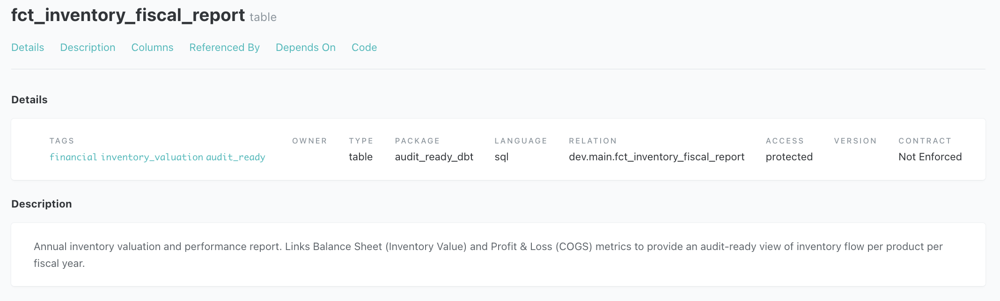

**Accounting Logic Implementation**
21 columns covering the full inventory lifecycle — B/S metrics (`beginning_inv_value`, `ending_gross_inv_value`, `ending_allowance_lcm`, `ending_net_realizable_value`), P&L metrics (`period_cogs_amount`, `period_revenue`), audit fields (`audit_check_diff`, `risk_tier`, `materiality_threshold`), and financial ratios (`inventory_turnover_ratio`, `gross_profit_margin`).
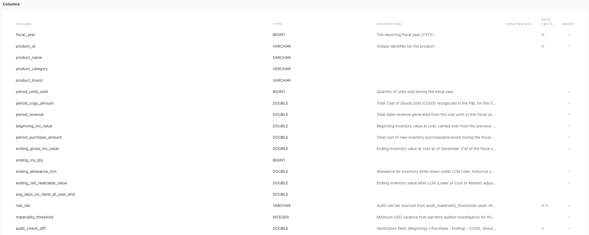
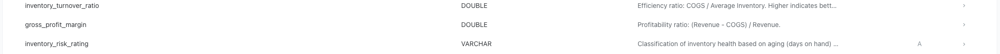

**Automated Internal Controls & Downstream Usage**
7 dbt tests enforcing: `not_null` on `fiscal_year`, `product_id`, `risk_tier`; `accepted_values` on `audit_check_diff` (must be `0`), `inventory_risk_rating` (Healthy / Warning: Slow Moving / Critical: Obsolete / Adjustment Required: NRV < Cost), `risk_tier` (High / Medium / Low); and `unique_combination_of_columns` on `(fiscal_year, product_id)`.
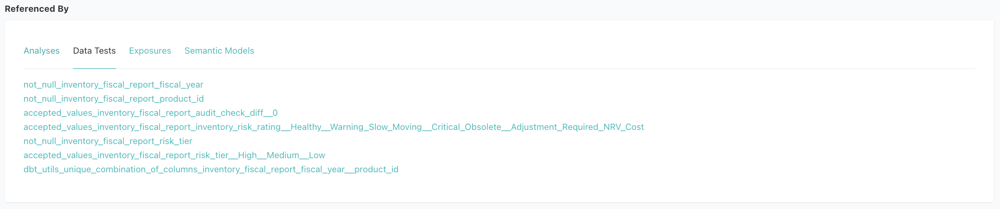

Referenced downstream by `audit_inventory_exceptions.sql` (ad-hoc audit analysis), the `inventory_fiscal_report` semantic model (MetricFlow), and the Inventory Dashboard exposure (Tableau) — the same tested mart feeds the audit drill-down, governed metric definitions, and the BI layer.
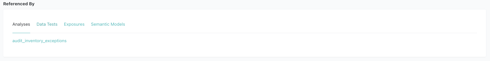
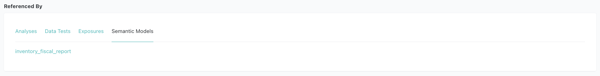
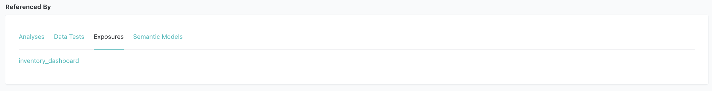

**Dependency Graph**
Depends on `int_inventory_items_joined` (model), `scd_products` (snapshot), `fiscal_year_end` (macro), and `audit_materiality_thresholds` (seed) — all four dbt node types wired into a single model.
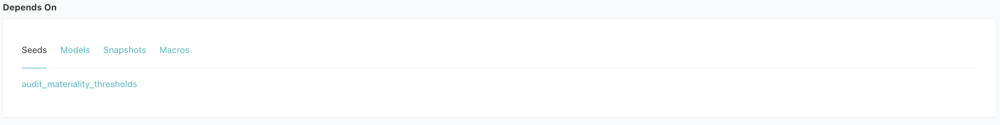
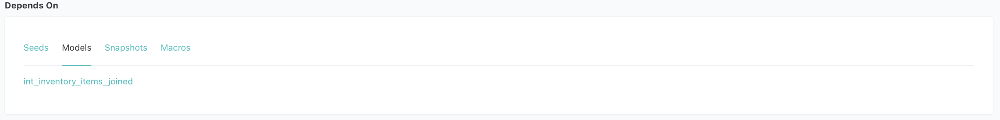
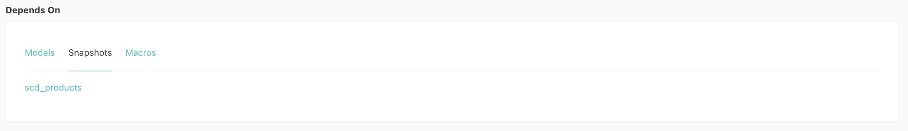
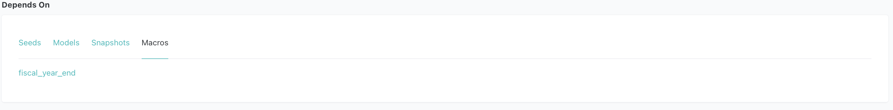

## 5. General Ledger Posting & Exception Pipeline (AWS Lambda)
* **Files**: 📂 `models/marts/finance/journal_entries.sql`, 📂 `models/marts/finance/journal_entry_lines.sql`, 📂 `lambdas/`
* **Division of labor**:
    - **dbt owns the accounting.** `journal_entry_lines` takes each amount from the mart that owns its recognition rule — revenue from `revenue.recognized_revenue`, returns from returned items in `order_item_revenue`, COGS from item-level historical cost — and `journal_entries` rolls them into one balanced Dr/Cr pair per posting date and entry type. The GL never re-derives recognition logic, so it cannot drift from the marts. Two tests enforce double-entry and control-total integrity on every build, on every warehouse.
    - **Lambda is the integration layer.** Invoked by Airflow once the Athena build and its tests pass, it exports the day's entries as a GL upload file with order/item-level support, runs the exception rules, and writes both to S3.

| Entry | Posting | Posting date | Source |
|---|---|---|---|
| `REV` | Dr 1200 Accounts Receivable / Cr 4000 Sales Revenue | `shipped_at` | `revenue.recognized_revenue` |
| `RET` | Dr 4100 Sales Returns & Allowances / Cr 1200 Accounts Receivable | `returned_at` | returned items in `order_item_revenue` |
| `COGS` | Dr 5000 Cost of Goods Sold / Cr 1300 Inventory | `shipped_at` | item-level cost (specific identification) |

* **Revenue recognition policy**: Revenue is recognized when control transfers under ASC 606 / IFRS 15. With FOB shipping-point terms, that is at **shipment**, consistent with `revenue.sql`. Under FOB destination terms the trigger would be `delivered_at` — a policy change that belongs in `revenue.sql`, not the GL layer.
* **Known simplification**: Returns are posted when they occur. Strict ASC 606 would estimate expected returns at the point of sale as a refund liability (variable consideration); that estimate is out of scope here.
* **Exception rules** (📂 `lambdas/je_pipeline/rules.py`, each covered by pytest in 📂 `lambdas/tests/`):

| Rule | Severity | Flags |
|---|---|---|
| `RECONCILIATION_BREAK` | High | Master/sub-ledger breaks — orphan or missing sub-ledger, item-count variance, unexplained status variance (explained partial refunds/shipments are excluded) |
| `CUTOFF_RISK` | Medium | Ordered and shipped in different months |
| `DUPLICATE_SUSPECT` | High | Same customer and amount within 10 minutes |
| `AMOUNT_OUTLIER` | Seed risk tier | Item price above the category's Q3 + 3×IQR; severity comes from `audit_materiality_thresholds` |
| `REFUND_EXCEEDS_REVENUE` | High | Refund larger than the order's gross revenue |

* **Outputs** (`s3://audit-ready-dbt-reports-*/je-pipeline/period=<start>_<end>/`): `journal_entries.csv` (GL upload file), `journal_detail.csv` (support for every amount), `exceptions.csv`, `run_summary.json`. The bucket is versioned with `DeletionPolicy: Retain` — each period's export is a point-in-time record of what was posted, which the marts cannot provide because incremental merges and fixes keep changing history.

  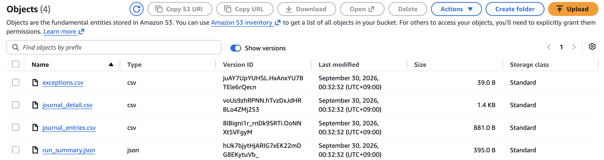
  *`je-pipeline/period=2026-09-29_2026-09-29/`, written by the daily DAG's `export_journal_entries` — the GL upload file (three balanced entries: revenue, returns, COGS), the order/item-level support, the exception report (header only: no exceptions that day), and the run summary*
* **Infrastructure as code** (📂 `lambdas/template.yaml`, deployed with AWS SAM): the function, its least-privilege execution role (Athena, Glue read, S3 read, write only to query results and the reports bucket), the reports bucket, and a 30-day log group. Deploys use a separate IAM user; the daily pipeline's user can only invoke the function.

  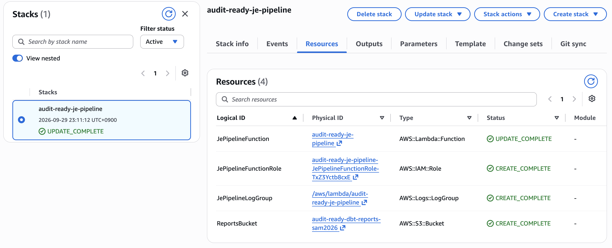
  *CloudFormation stack `audit-ready-je-pipeline`, deployed by SAM from `lambdas/template.yaml` — the Lambda function, its execution role, the log group, and the versioned reports bucket. Code redeploys update only the function; the role, bucket, and log group are untouched.*
* **First-run finding → detective to preventive control**: On its first real run, a `FUTURE_DATED_SHIPMENT` exception rule flagged orders whose `shipped_at` had been written up to 48 hours *ahead* of generation time by the synthetic-data generator — `revenue` was recognizing revenue for shipments that had not happened yet (139 future-dated events in the marts). The root cause was fixed in the generator (see [architecture](architecture.md#1-ingestion--synthetic-data-generation)), and the check moved from the Lambda, which could only report it *after* posting, into an error-severity dbt test (`assert_no_future_dated_events`) that fails the Athena build and so blocks the GL export.
* **Verification**: [`docs/je_pipeline_verification.md`](je_pipeline_verification.md).
