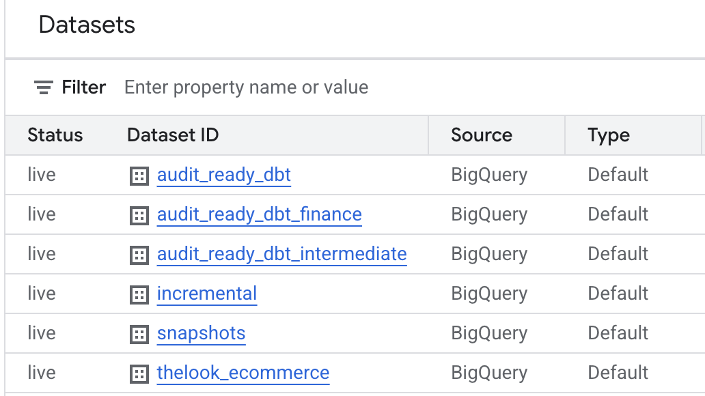
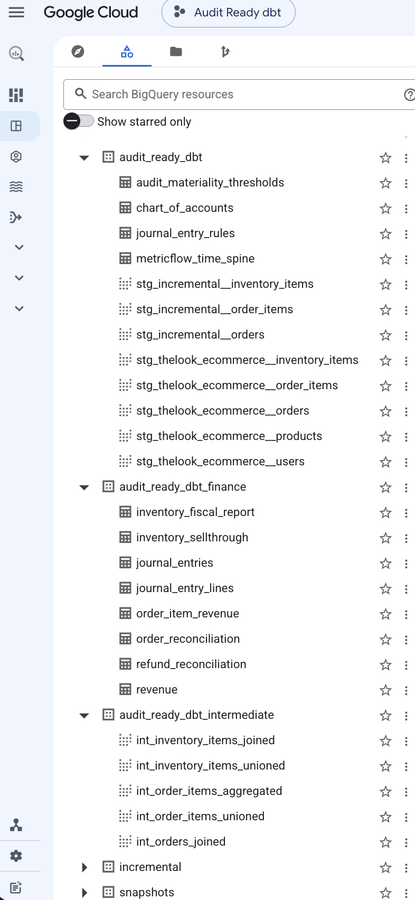
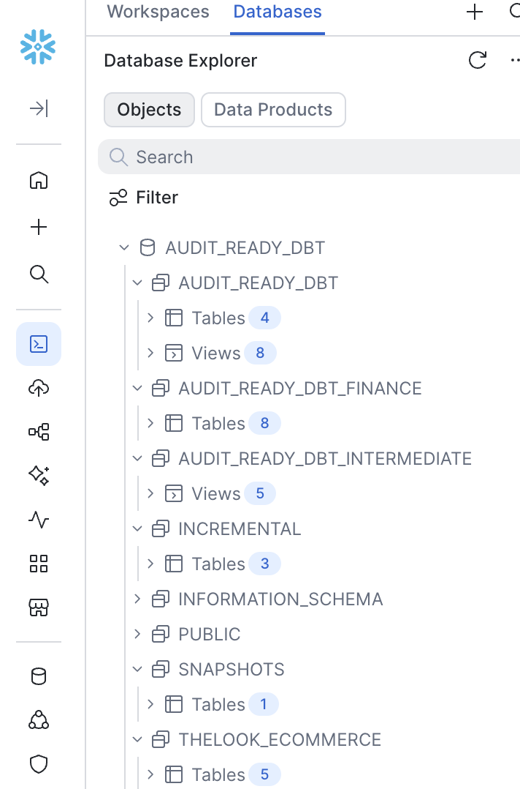
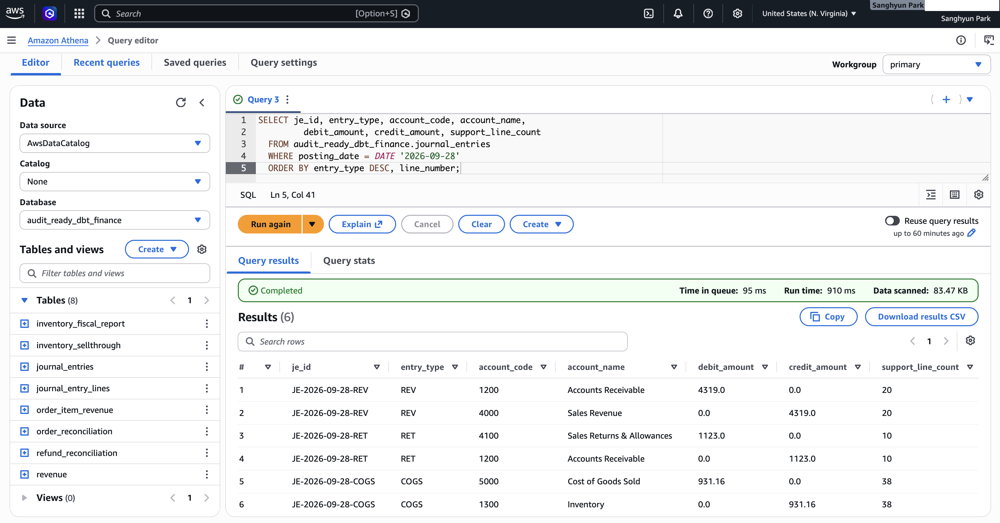
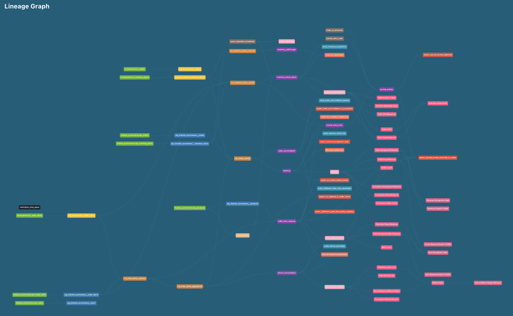
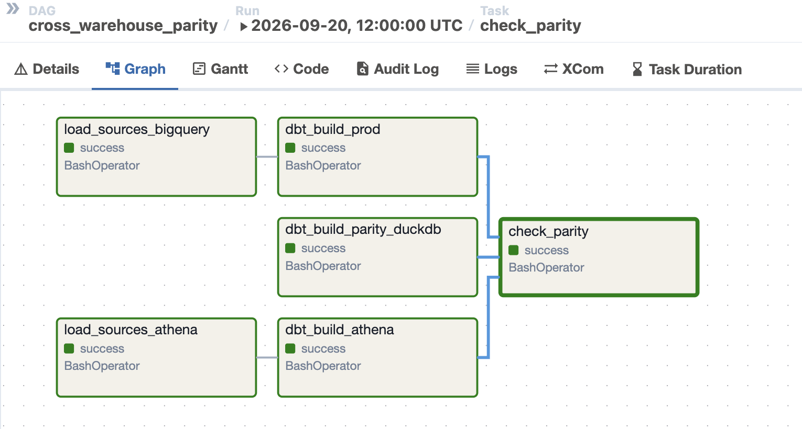
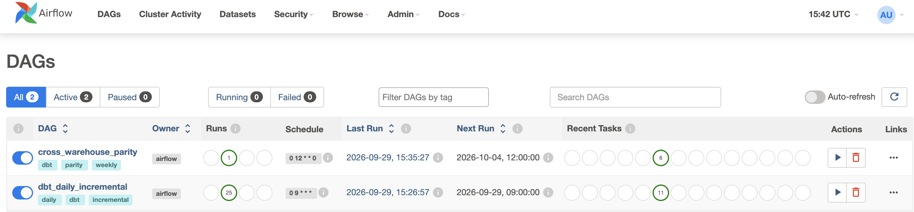
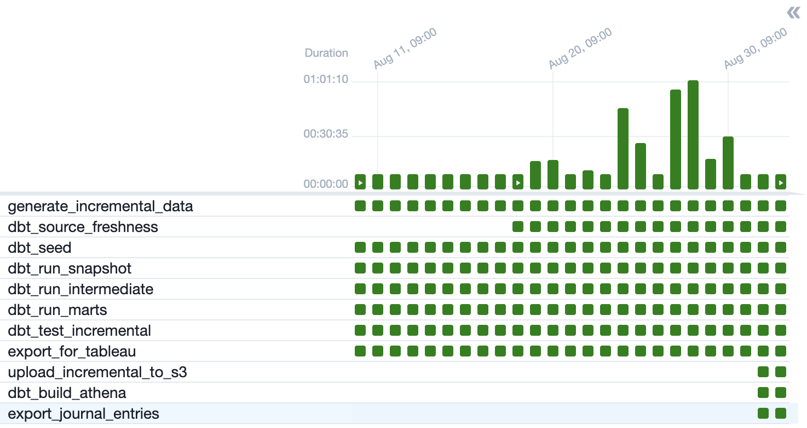
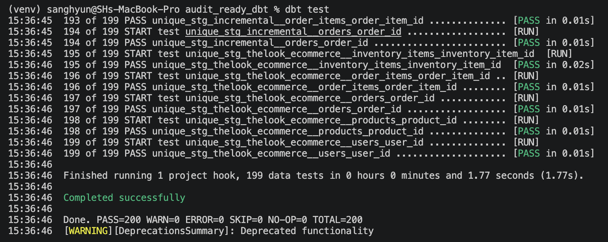
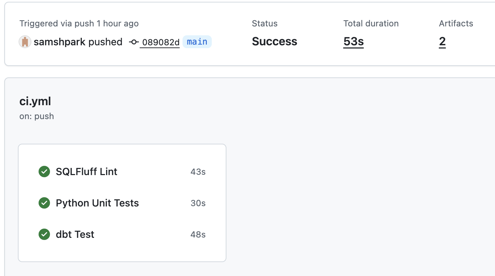

# Architecture

## Project Overview

A portfolio project built by a **CPA (Big 4, Accounting Advisory Manager)** applying accounting controls expertise to the modern data stack — not just building a pipeline, but embedding the internal controls and reconciliation logic that financial reporting depends on.

* **Data Sources**:
  - [TheLook E-commerce](https://console.cloud.google.com/marketplace/product/bigquery-public-data/thelook-ecommerce) — a public BigQuery dataset simulating a fashion e-commerce business. `scripts/ingest_data.py` seeds from 1,000 random products, then pulls every order that touches them (plus each order's other line items) — snowballing via referential integrity to ~5.9K products / ~6.2K orders in the final extract.
  - Airflow-generated synthetic incremental data — daily orders (starting ~15/day and growing ~5%/month, continuing the BigQuery source's own growth trend past its ingestion cutoff) including partial refund scenarios (15%), injected via `scripts/generate_daily_incremental.py`
* **Objective**: Transform raw transactional logs into audit-ready financial marts with automated internal controls
* **Core Value**: Bridge the gap between system logs and GAAP/IFRS standards by embedding reconciliation logic, revenue recognition, and inventory valuation directly into the transformation layer

## Tech Stack & Engineering Value
* **Stack**: SQL, Python, dbt-core, DuckDB, BigQuery, Snowflake, **AWS (S3, Glue Data Catalog, Athena, Lambda, SAM/CloudFormation, IAM)**, Apache Airflow, Docker, Parquet, Iceberg, MetricFlow, SQLFluff, Ruff, pytest.
* **Audit Trail**: Every model is documented with metadata to provide a clear path from raw data to final report — essential for financial audits.
* **Cost-Efficiency**: By developing against a **Python-to-DuckDB** local pipeline instead of iterating directly against BigQuery, development-time warehouse compute costs are close to zero — BigQuery is only touched once, at ingestion.
* **Idempotency**: Designed models to be idempotent, ensuring that re-running the pipeline produces consistent financial results without duplication.

## Hybrid Data Architecture
I adopted a hybrid architecture to balance development efficiency with production scalability.

### 1. Ingestion & Synthetic Data Generation
* **Python Extraction** (📂 `scripts/ingest_data.py`): Extracts BigQuery raw data into local **Parquet** (`raw_*.parquet`) files via API.
* **Airflow Daily Simulation** (📂 `scripts/generate_daily_incremental.py`): Creates each business date's synthetic orders — starting at ~15/day and growing ~5%/month from the BigQuery ingestion cutoff, so the incremental layer continues that source's own growth trend instead of flatlining — including partial refund scenarios (15%) — in separate `incr_*.parquet` files, keeping the BigQuery source layer immutable.
    - **Event-driven lifecycle**: every order has a fixed plan derived from its `order_id` (refund type, shipping delay, transit and return times, and for ~23% of orders a backlog that later ships or is cancelled). Each run advances every synthetic order to the current time and writes **only events that have already happened** — an order stays `Processing` until its planned shipment arrives, then moves to `Shipped`, `Complete`, and (if planned) `Returned` on later runs. Nothing is ever dated in the future, so revenue is never recognized ahead of shipment.
    - **Idempotent and reproducible**: a date that already has orders is skipped, so Airflow catch-up runs and retries never duplicate a day; creation is seeded by date, so `--reset --backfill-from 2025-06-01` rebuilds the same orders on any machine. Covered by pytest (📂 `scripts/tests/`).
* **AWS Source Layer** (📂 `scripts/load_to_s3_athena.py`): Publishes the same Parquet files to **S3** and registers them as **Glue Data Catalog** external tables (one Glue database per dbt source), so the Athena target reads identical source data. Rewrites nanosecond timestamps to microseconds on upload (Athena's Parquet reader rejects ns); `--source incremental` republishes only the daily files.
* **BigQuery Source Layer** (📂 `scripts/load_to_bigquery.py`): Loads the same Parquet files into BigQuery for the weekly cross-warehouse parity run. Each table is dropped and recreated, which restarts the BigQuery sandbox's 60-day table expiry. Both loaders share one source definition and timestamp handling (📂 `scripts/source_files.py`).
* **Local Data Lake**:
    - `data/raw_*.parquet` (5 files, ~4 MB) — BigQuery-sourced, read-only. **Tracked in git** for reviewer convenience; regenerate via `scripts/ingest_data.py` if needed.
    - `data/incr_*.parquet` (3 files) — Airflow-generated daily incremental data. **Not tracked in git** (changes daily); initialize once via `scripts/generate_daily_incremental.py --reset --backfill-from 2025-06-01`, then updated automatically by the Airflow pipeline.
* **Seeds** (`seeds/`):
    - 📂 `seeds/audit_materiality_thresholds.csv` — CPA-defined audit risk tier and materiality threshold per product category (lookup table)
    - 📂 `seeds/chart_of_accounts.csv` — GL accounts with account type and normal balance
    - 📂 `seeds/journal_entry_rules.csv` — posting rules (debit / credit account per entry type), kept as data so accounting-policy changes are reviewed without touching SQL

### 2. High-Performance Local Development
* **Engine**: Powered by **DuckDB**, optimized for **Apple Silicon** to enable rapid iteration with zero cloud costs.
* **Multi-Environment**: **dbt profiles** (`profiles.yml`) are configured to switch from local DuckDB to **BigQuery**, **Snowflake**, or **AWS Athena** with a single command. All models are written against dbt's cross-database macros (`dbt.type_float()`, `dbt.type_string()`, `dbt.datediff()`, `dbt.date_trunc()`, `dbt_utils.date_spine()`) rather than warehouse-specific syntax (`interval` literals, `double`/`varchar` casts, `DATE - DATE` arithmetic, `string_agg(... order by ...)`), so the same SQL runs unmodified across all four.
    - **BigQuery run results**: Verified end-to-end on 2026-09-12 — `dbt build --target prod` against the live BigQuery warehouse completed with zero errors (166 pass / 22 success / 1 expected warn). See [`docs/bigquery_prod_verification.md`](bigquery_prod_verification.md) for details.
      
      
    - **Snowflake run results**: Verified end-to-end on 2026-09-13 — `dbt build --target snowflake` against a live Snowflake warehouse completed with zero errors (166 pass / 22 success / 1 expected warn). See [`docs/snowflake_prod_verification.md`](snowflake_prod_verification.md) for details.
      
    - **AWS Athena run results**: Verified end-to-end on 2026-09-29 — `dbt build --target athena` against **S3 + Glue Data Catalog + Athena** completed with zero errors (166 pass / 22 success / 1 expected warn), identical to BigQuery and Snowflake. Incremental marts are stored as **Iceberg** tables so `merge` works on Athena; a follow-up incremental run confirmed rows were upserted without duplicates. Access uses a dedicated least-privilege IAM user scoped to the project's S3 buckets. See [`docs/athena_prod_verification.md`](athena_prod_verification.md) for details.
      
      *Athena query editor — the tables dbt built in `audit_ready_dbt_finance` (left), and one day's journal entries: three balanced debit/credit pairs (revenue, returns, COGS) with the number of order/item lines behind each*
    - **Cross-warehouse parity (automated)**: Passing tests on every warehouse doesn't prove the *numbers* agree. The weekly `cross_warehouse_parity` DAG loads identical sources into DuckDB, BigQuery, and Athena, fully rebuilds each, and compares journal-entry debits, row counts, and headline mart totals to the cent. Its first run caught two real DuckDB-only defects the per-warehouse test suites had missed — 32-bit float currency columns and host-time-zone-dependent posting dates — both fixed (see the macros table below). See [`docs/cross_warehouse_parity.md`](cross_warehouse_parity.md).

### 3. Modular Transformation (dbt)

**Visualizing the Audit-Ready Data Pipeline**
* **Layered Architecture**: Implemented a 4-tier structure (Staging → Intermediate → Marts → Semantic Layer) to ensure data traceability.
* **Color-Coded Nodes**:
    -  Raw Sources: BigQuery thelook & Airflow incremental
    -  Seeds (lookup tables)
    -  Staging Layer - thelookecommerce
    -  Staging Layer - Incremental
    -  Intermediate Layer
    -  Financial Marts
    -  Snapshots (scd_products)
    -  Analyses
    -  Semantic Models (MetricFlow)
    -  MetricFlow Metrics
    -  Utilities
    -  Automated Data Quality Tests (Singular Tests)
    -  Exposures (Tableau dashboards)

#### Model Directory
* **Staging Layer** (`models/staging/thelook_ecommerce/`):
    - 📂 `stg_thelook_ecommerce__orders.sql`
    - 📂 `stg_thelook_ecommerce__order_items.sql`
    - 📂 `stg_thelook_ecommerce__products.sql`
    - 📂 `stg_thelook_ecommerce__users.sql`
    - 📂 `stg_thelook_ecommerce__inventory_items.sql`
    - 📂 `_thelook_ecommerce__sources.yml` — source definitions pointing to `raw_*.parquet`
    - 📂 `_thelook_ecommerce__models.yml` — consolidated model documentation

* **Staging Layer — Incremental** (`models/staging/incremental/`):
    - 📂 `stg_incremental__order_items.sql`
    - 📂 `stg_incremental__orders.sql`
    - 📂 `stg_incremental__inventory_items.sql`
    - 📂 `_incremental__sources.yml` — source definitions pointing to `incr_*.parquet`
    - 📂 `_incremental__models.yml` — consolidated model documentation

* **Intermediate Layer** (`models/intermediate/`):
  - **Orders** (`orders/`):
      - 📂 `int_order_items_unioned.sql`: UNION ALL of BigQuery-sourced and incremental order items at item grain. Shared base for `int_order_items_aggregated` and `order_item_revenue`.
      - 📂 `int_order_items_aggregated.sql`: Sub-ledger aggregation per `order_id` (item count, total amount, refund rollup).
      - 📂 `int_orders_joined.sql`: FULL JOIN of master ledger (`stg_orders`) and sub-ledger (`int_order_items_aggregated`). Shared base for `order_reconciliation` and `revenue` marts — eliminates duplicate join logic.
      - 📂 `_int_orders__models.yml` — consolidated model documentation
  - **Inventory** (`inventory/`):
      - 📂 `int_inventory_items_joined.sql`: Item-level lifecycle join (inbound ↔ outbound) with LCM valuation logic.
      - 📂 `int_inventory_items_unioned.sql`: UNION ALL of raw inventory receipts, one row per unit.
      - 📂 `_int_inventory__models.yml` — consolidated model documentation

* **Marts (Audit Layer)** (`models/marts/finance/`):
    - 📂 `order_reconciliation.sql`: Master-to-Subledger reconciliation, including a status-variance detail column that separates benign patterns (partial refund/shipment) from true anomalies.
    - 📂 `revenue.sql`: Accrual-based revenue recognition with cut-off risk detection.
    - 📂 `refund_reconciliation.sql`: Linking refunds to original orders.
    - 📂 `inventory_fiscal_report.sql`: Annual inventory valuation — COGS, LCM write-down, audit check, turnover ratios, and CPA-defined `risk_tier` / `materiality_threshold` per product category.
    - 📂 `order_item_revenue.sql`: Item-level revenue model (grain: one row per order item), including product category/brand/name. Enables status-level breakdown (`complete` / `returned` / `shipped` etc.) that is not possible at order grain — essential for partial refund scenarios where a single order contains items with different statuses.
    - 📂 `inventory_sellthrough.sql`: One row per physical inventory unit received, independent of order fulfillment status — answers "has this unit ever sold" directly.
    - 📂 `journal_entry_lines.sql`: GL support — one row per source document (order for revenue, order item for returns, inventory item for COGS), with amounts taken from the marts that own each recognition rule.
    - 📂 `journal_entries.sql`: Summarized GL postings — one balanced debit/credit pair per posting date and entry type, mapped through the `journal_entry_rules` and `chart_of_accounts` seeds. See [GL pipeline](accounting_logic.md#5-general-ledger-posting--exception-pipeline-aws-lambda).
    - 📂 `_finance__models.yml` — consolidated model documentation
    - 📂 `_finance__semantic_models.yml` — MetricFlow semantic model definitions
    - 📂 `_finance__metrics.yml` — business metric definitions
    - 📂 `_finance__exposures.yml` — downstream Tableau dashboard declarations (owner, dependencies)

* **Utilities Layer** (`models/utilities/`):
    - 📂 `metricflow_time_spine.sql` — date spine table required by MetricFlow for time-based metric aggregation
    - 📂 `_utilities__models.yml` — consolidated model documentation

> **Materialization Strategy**:
> - **Staging**: `view` — zero storage cost, always reflects the latest source data.
> - **Intermediate**: `view` (not `ephemeral`) — dbt best practice suggests ephemeral for intermediate models to avoid creating unnecessary DB objects. This project deliberately uses views instead for two reasons:
>   1. `int_order_items_aggregated` is referenced by three downstream marts — ephemeral would inline and re-execute the same complex aggregation SQL three times;
>   2. intermediate models contain non-trivial join and aggregation logic that benefits from being directly queryable for debugging and validation.
> - **Marts**: `order_reconciliation`, `revenue`, `refund_reconciliation`, and `order_item_revenue` use **incremental models** (`merge` strategy) with a lookback window (`incremental_lookback_days`, default: 14 days) filtered on business timestamps (`created_at`, `shipped_at`, `returned_at`/`last_refund_at`) to catch late shipments and returns. Since that only re-scans *recent* timestamps, `dbt_run_marts` also runs `--full-refresh` on Sundays to catch backdated corrections older than the window. `inventory_fiscal_report`, `inventory_sellthrough`, `journal_entry_lines`, and `journal_entries` are plain full-refresh **tables** — cross-year LAG calculations, the pass-through sell-through view, and the GL (which must always tie to the current marts) all need complete recalculation, not incremental merge.
> - **Utilities**: `table` — `metricflow_time_spine` is materialized as a static table since MetricFlow requires a pre-built date spine to perform time-based aggregations.

#### Jinja Macros
Repeated SQL expressions are extracted into reusable macros to enforce DRY principles and make business logic easier to maintain. Documented in 📂 `macros/_macros.yml`.

| Macro | Usage | Purpose |
|---|---|---|
| `fiscal_year_end(year_col)` | `inventory_fiscal_report` (×3) | Returns the fiscal year-end date (`YYYY-12-31`) as a `DATE`, capped at `current_date` so the year still in progress is evaluated as of today rather than a not-yet-elapsed December 31st |
| `datediff_days(start, end)` | `int_inventory_items_joined` (×2), `inventory_fiscal_report` (×1) | Calculates day difference between two date columns via `dbt.datediff()`, used for inventory aging/velocity buckets and fiscal year-end day counts |
| `within_incremental_lookback(column)` | `order_reconciliation`, `revenue`, `order_item_revenue` (×3 each), `refund_reconciliation` (×2) | Returns whether a timestamp column falls within the incremental lookback window (`var("incremental_lookback_days")`), used to build each incremental mart's `is_incremental()` filter |
| `string_agg_distinct(column)` | `int_order_items_aggregated` (×1) | Concatenates a column's distinct values, ordered — dispatches to `listagg(distinct col, sep) within group (order by col)` on Snowflake (no `string_agg(... order by ...)` equivalent there), `array_join(array_sort(array_distinct(array_agg(col))), sep)` on Athena (Trino has neither form), and `string_agg(distinct col order by col)` elsewhere |
| `duckdb__type_float()` | every `dbt.type_float()` call on DuckDB | Overrides dbt's DuckDB `float` (32-bit REAL) with `double`, matching the 64-bit float every other warehouse uses — REAL silently loses cents on currency columns |
| `duckdb__alter_column_type()` | incremental models with `on_schema_change='sync_all_columns'` | Changes a column type with a single `ALTER COLUMN ... TYPE`. dbt's default four-statement swap followed by the `MERGE` in the same transaction fails to commit on DuckDB, so an existing incremental table could never change a column type in place |
| `set_utc_session_timezone()` | `on-run-start` hook | Pins DuckDB's session time zone to UTC so casting UTC source timestamps doesn't shift posting dates or month-end cut-off to the host machine's zone; renders nothing on other adapters |

```sql
-- Example: fiscal_year_end macro in use
LEFT JOIN {{ ref('scd_products') }} scd
    ON  l.product_id = scd.product_id
    AND {{ fiscal_year_end('y.fiscal_year') }} >= scd.dbt_valid_from
    AND (scd.dbt_valid_to IS NULL OR {{ fiscal_year_end('y.fiscal_year') }} < scd.dbt_valid_to)
```

### 4. Orchestration (Apache Airflow + Docker)
* **File**: 📂 `dags/dbt_incremental_pipeline.py`
* **Schedule**: Daily at 09:00 UTC, containerized via `docker-compose.yml`
* **Pipeline**: after step 1 the DAG forks into a local **DuckDB branch** (feeds the Tableau exports) and an **AWS branch** (the production Athena warehouse and the journal-entry export).
    1. `generate_incremental_data` — Creates the business date's (`ds`) synthetic orders in `incr_*.parquet` — separate from the immutable BigQuery-sourced `raw_*.parquet` — and advances every synthetic order's lifecycle to the current time
    2. `dbt_source_freshness` — Checks `incr_orders` / `incr_order_items` freshness (warn after 30h, error after 54h, sized to the daily cadence). Placed right after the step that just wrote today's data, so it always passes when the DAG runs at all — it demonstrates the mechanism rather than catching a real failure mode, since the one failure that matters here (the host machine being off) leaves nothing running to report it. See the task's `doc_md` for the full caveat.
    3. `dbt_seed` — Reloads the `audit_materiality_thresholds`, `chart_of_accounts`, and `journal_entry_rules` lookup tables so threshold or posting-rule changes take effect without manual intervention
    4. `dbt_run_snapshot` — Refreshes `scd_products` SCD Type 2 snapshot to capture daily price/cost changes
    5. `dbt_run_intermediate` — Recreates all five intermediate views. Views already reflect current data on every query (no dbt run needed for freshness) — this step is a safety net that keeps view definitions in sync if a model's SQL changes.
    6. `dbt_run_marts` — Incremental merge into `order_reconciliation`, `revenue`, `refund_reconciliation`, `order_item_revenue` (full-refresh instead on Sundays, to catch backdated corrections the lookback window can't see); full-refresh rebuild of `inventory_fiscal_report` and `inventory_sellthrough` (plain table materializations — cross-year LAG logic and the unit-level sell-through view both need complete recalculation, not a partial merge)
    7. `dbt_test_incremental` — Runs tests on `stg_incremental__*`, intermediate, and mart models to validate pipeline output
    8. `export_for_tableau` — Exports all six mart tables to `tableau_exports/*.csv` for Tableau Public (overwrites on each run)

    **AWS branch** (runs in parallel with steps 2–8):

    - a. `upload_incremental_to_s3` — Republishes `incr_*.parquet` to S3 and re-registers the Glue tables
    - b. `dbt_build_athena` — `dbt build --target athena`: every model and test, including the journal balance and control-total tests, so a failing control stops the branch before anything is posted. Uses its own `--target-path` so it never collides with the DuckDB branch's `target/`.
    - c. `export_journal_entries` — Invokes the `audit-ready-je-pipeline` Lambda for the run's business date (see [GL pipeline](accounting_logic.md#5-general-ledger-posting--exception-pipeline-aws-lambda))

> **Note**: The DuckDB steps run sequentially (chained with `>>`) to avoid DuckDB write-lock contention — DuckDB allows only one writer at a time. `max_active_runs=1` additionally ensures no two DAG runs overlap. The Airflow containers read AWS credentials from a read-only mount of `~/.aws` (never from the repo); the daily pipeline's IAM user can *invoke* the Lambda but not change it.

* **Weekly parity check** (📂 `dags/cross_warehouse_parity.py`, Sundays 12:00 UTC or manual): reloads all sources into BigQuery and Athena, runs `dbt build --full-refresh` on DuckDB (a separate `parity.duckdb`), BigQuery, and Athena in parallel, then `scripts/check_warehouse_parity.py` compares ten metrics across all three via `dbt show` — so `ref()` resolves per warehouse and no engine-specific SQL is needed — and fails on any difference. Snowflake is excluded because it ran on a 30-day trial.

  
  *`cross_warehouse_parity` — BigQuery and Athena source loads, full-refresh builds on DuckDB, BigQuery, and Athena in parallel, then `check_parity`*



*DAG list — the daily pipeline and the weekly parity check*



*Grid view — daily runs succeeding; the three AWS-branch tasks appear from the latest runs*

### 5. SCD Type 2 Snapshot (Product Price Tracking)
* **File**: 📂 `snapshots/scd_products.sql`
* **Strategy**: `check` — tracks row-level changes on `cost`, `retail_price`, `product_name`, `category` using `dbt snapshot`.
* **Purpose**: Maintains a full historical record of product price and category changes, enabling point-in-time inventory valuation and audit traceability without overwriting prior states.
* **Hard Delete Handling**: `invalidate_hard_deletes=True` ensures removed products are flagged rather than silently dropped from history.

### 6. Quality Control
* **Automated Reconciliation**: Custom dbt tests to flag financial discrepancies.

> All 200 tests pass. `assert_fulfillment_lead_time_within_baseline` is intentionally warn-severity: it flags a known source-data defect (see below) that can't be fixed at the transform layer, so it warns rather than blocks — and currently doesn't fire.

    * **Model Schema Tests** (column-level constraints & descriptions):
        - 📂 `models/staging/thelook_ecommerce/_thelook_ecommerce__models.yml`
        - 📂 `models/staging/thelook_ecommerce/_thelook_ecommerce__sources.yml`
        - 📂 `models/staging/incremental/_incremental__models.yml`
        - 📂 `models/staging/incremental/_incremental__sources.yml`
        - 📂 `models/intermediate/inventory/_int_inventory__models.yml`
        - 📂 `models/intermediate/orders/_int_orders__models.yml`
        - 📂 `models/marts/finance/_finance__models.yml`
    
    * **Custom Assertion Tests** (business-logic validation):
        - 📂 `tests/assert_order_reconciliation_is_successful.sql`
        - 📂 `tests/assert_no_variance_in_order_recon.sql`
        - 📂 `tests/assert_revenue_recognition_logic.sql`
        - 📂 `tests/assert_fulfillment_lead_time_within_baseline.sql` — warns if the negative-lead-time rate rises well past its historical baseline
        - 📂 `tests/assert_journal_entries_balanced.sql` — every journal entry's debits equal its credits to the cent
        - 📂 `tests/assert_journal_entries_reconcile_to_marts.sql` — control totals: posted revenue ties to the item-level subledger, returns to `refund_reconciliation`, COGS to `inventory_fiscal_report`
        - 📂 `tests/assert_no_future_dated_events.sql` — preventive control: no order, shipment, or return dated after the build runs; on the daily Athena branch a failure stops the build before any journal entry is posted
    
    * **Audit Exception Analyses** (`analyses/`) — ad-hoc audit queries compiled via `dbt compile`, using `{{ ref() }}` for table references. Copy the rendered SQL from `target/compiled/` to run directly against DuckDB:
        - 📂 `audit_inventory_exceptions.sql` — flags inventory equation imbalances (`audit_check_diff ≠ 0`), LCM write-down candidates, and slow-moving/obsolete stock
        - 📂 `audit_revenue_cutoff_risk.sql` — surfaces cut-off risk orders (created in one month, shipped in another) and pending shipments with unrecognized revenue
        - 📂 `audit_order_reconciliation_failures.sql` — lists orphan sub-ledger, missing sub-ledger, item count variances, and status mismatches between master and sub-ledger
        - 📂 `audit_refund_anomalies.sql` — detects partial refund patterns, high-value full reversals, and orders where refund exceeds 50% of gross revenue
        - 📂 `audit_fulfillment_lead_time_anomalies.sql` — flags items where `shipped_at` precedes `created_at`, a source-data defect traced to the raw feed
* **CI** (GitHub Actions — 📂 `.github/workflows/ci.yml`): Every pull request runs **Slim CI** — `dbt build --select state:modified+ --defer`, which builds and tests only changed models and their downstream, deferring everything else to `main`'s last successful build. Every push to `main` runs a full `dbt build` and publishes that baseline. SQLFluff lint runs on both. Since DuckDB is a single-file database rather than a persistent shared warehouse, that baseline is both the `manifest.json` *and* the built `dev.duckdb` itself, uploaded as a GitHub Actions artifact on every successful `main` push and restored at the start of the next PR; if no baseline exists yet, it falls back to a full build. A separate job runs Ruff and the pytest suites (`lambdas/`, `scripts/`) on Python 3.12 (the Lambda runtime). dbt-core is pinned to the version used locally and in the Airflow image, and Slim CI only defers to a baseline built by the same dbt version — otherwise it falls back to a full build, since a newer dbt's manifest may not parse.

  
  *CI on `main` — SQL lint, the dbt build, and the Python unit tests (Lambda + generator) run as three parallel jobs. The two artifacts are this build's `manifest.json` and `dev.duckdb`, which the next PR's Slim CI defers to.*

### 7. SQL Code Quality (SQLFluff)
* **Linter**: [SQLFluff](https://sqlfluff.com/) — DuckDB dialect, dbt Jinja templater (📂 `.sqlfluff`). Enforces consistent formatting and explicit column qualification across all SQL models.

### 8. Python Code Quality (Ruff)
* **Linter & Formatter**: [Ruff](https://docs.astral.sh/ruff/) — configured in 📂 `pyproject.toml`.

### 9. YAML Code Quality (Prettier + dbt JSON Schema)
* **Formatter**: [Prettier](https://prettier.io/) — configured in 📂 `.prettierrc`. Run `npm install` to set up.
* **Schema Validation**: [dbt JSON Schema](https://github.com/dbt-labs/dbt-jsonschema) — validates dbt YAML structure in VS Code (📂 `.vscode/settings.json`).
