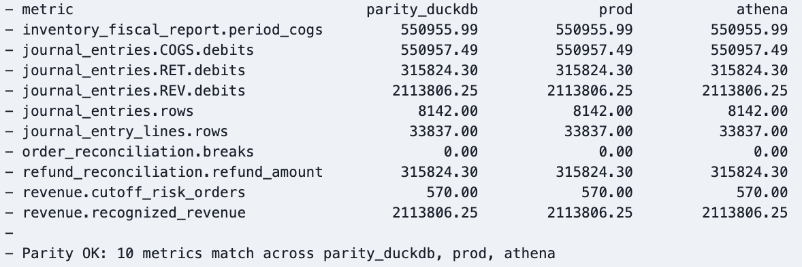

# Cross-Warehouse Parity

Evidence that the books agree **to the cent** on every warehouse — not just
that each warehouse's test suite passes. Backs the Multi-Environment claim in
the [README](../README.md#2-high-performance-local-development).

- **Date**: 2026-09-29
- **How**: the `cross_warehouse_parity` DAG ([`dags/cross_warehouse_parity.py`](../dags/cross_warehouse_parity.py)),
  or manually:
  ```bash
  python scripts/load_to_bigquery.py && python scripts/load_to_s3_athena.py
  dbt build --target parity_duckdb --full-refresh --target-path target_parity_duckdb
  dbt build --target prod          --full-refresh --target-path target_prod
  dbt build --target athena        --full-refresh --target-path target_athena
  python scripts/check_warehouse_parity.py --targets parity_duckdb prod athena
  ```
- **Comparison**: [`scripts/check_warehouse_parity.py`](../scripts/check_warehouse_parity.py) runs one
  metrics query per target through `dbt show`, so `ref()` resolves to each
  warehouse's own relations and no engine-specific SQL or client is needed.
  Tolerance: 0.01 on amounts, exact on counts.

## Result

Airflow run, 2026-09-29: all three builds 226 pass / 0 error; all ten metrics match.



*`check_parity` task log from that run*

| Metric | DuckDB | BigQuery | Athena |
|---|---|---|---|
| `inventory_fiscal_report.period_cogs` | 550,955.99 | 550,955.99 | 550,955.99 |
| `journal_entries.COGS.debits` | 550,957.49 | 550,957.49 | 550,957.49 |
| `journal_entries.RET.debits` | 315,824.30 | 315,824.30 | 315,824.30 |
| `journal_entries.REV.debits` | 2,113,806.25 | 2,113,806.25 | 2,113,806.25 |
| `journal_entries.rows` | 8,142 | 8,142 | 8,142 |
| `journal_entry_lines.rows` | 33,837 | 33,837 | 33,837 |
| `order_reconciliation.breaks` | 0 | 0 | 0 |
| `refund_reconciliation.refund_amount` | 315,824.30 | 315,824.30 | 315,824.30 |
| `revenue.cutoff_risk_orders` | 570 | 570 | 570 |
| `revenue.recognized_revenue` | 2,113,806.25 | 2,113,806.25 | 2,113,806.25 |

The first passing comparison, run locally earlier the same day on the
pre-fix synthetic data (224 pass per build), matched in the same way:
recognized revenue 2,038,244.25, COGS debits 544,376.73, and 8,022 journal
entries on all three warehouses.

## Defects found by the first run

The first comparison **failed**: BigQuery and Athena agreed on every metric,
but DuckDB differed on four. Every warehouse's own tests had passed, which is
exactly the gap this check exists to close.

| Metric | DuckDB (before fix) | BigQuery / Athena |
|---|---|---|
| `journal_entries.COGS.debits` | 544,377.32 | 544,376.73 |
| `inventory_fiscal_report.period_cogs` | 544,375.46 | 544,375.23 |
| `journal_entries.rows` | 8,078 | 8,022 |
| `revenue.cutoff_risk_orders` | 626 | 534 |

**1. Currency stored as 32-bit float.** Staging casts amounts with
`dbt.type_float()`, which renders `float` — 32-bit REAL on DuckDB, 64-bit on
BigQuery, Snowflake, and Athena. A unit cost of `44.475000095` became
`44.474998474` and rounded to the wrong cent; 547 COGS lines sat on such a
rounding boundary, a 0.59 difference in total. Fixed with a project-level
`duckdb__type_float()` override returning `double`
([`macros/duckdb_overrides.sql`](../macros/duckdb_overrides.sql)); no model SQL changed.

**2. Posting dates depended on the host's time zone.** Source timestamps are
UTC (`TIMESTAMPTZ` in DuckDB), and DuckDB converts them to the session time
zone — the developer machine's `Asia/Seoul` — when staging casts them to
`TIMESTAMP`. Orders near midnight UTC moved to the next day (more distinct
posting dates, so more journal entries) and orders near month-end moved to
the next month (more cut-off risk flags). CI and the Airflow containers run
in UTC, so only local builds were affected. Fixed with an `on-run-start`
hook, `set_utc_session_timezone()`, that pins DuckDB's session to UTC and
renders nothing on other adapters.

## Notes

- **Snowflake** is excluded from the scheduled check because it ran on a
  30-day trial; its one-time build is in
  [`snowflake_prod_verification.md`](snowflake_prod_verification.md).
- **BigQuery** runs in sandbox mode, whose datasets expire tables after 60
  days. The loader drops and recreates each source table, which restarts the
  window on every parity run.
- Each target builds into its own `--target-path`, so the three parallel
  builds never overwrite each other's `manifest.json` / `run_results.json`.
