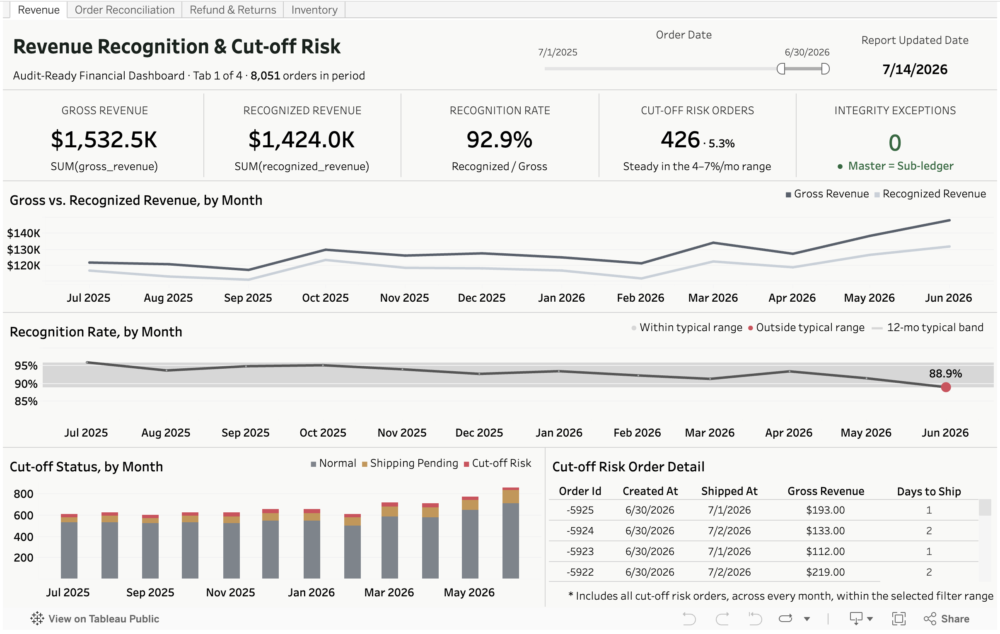
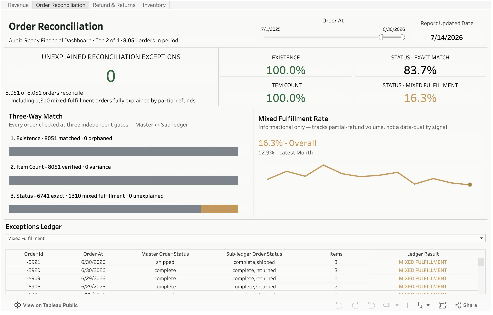
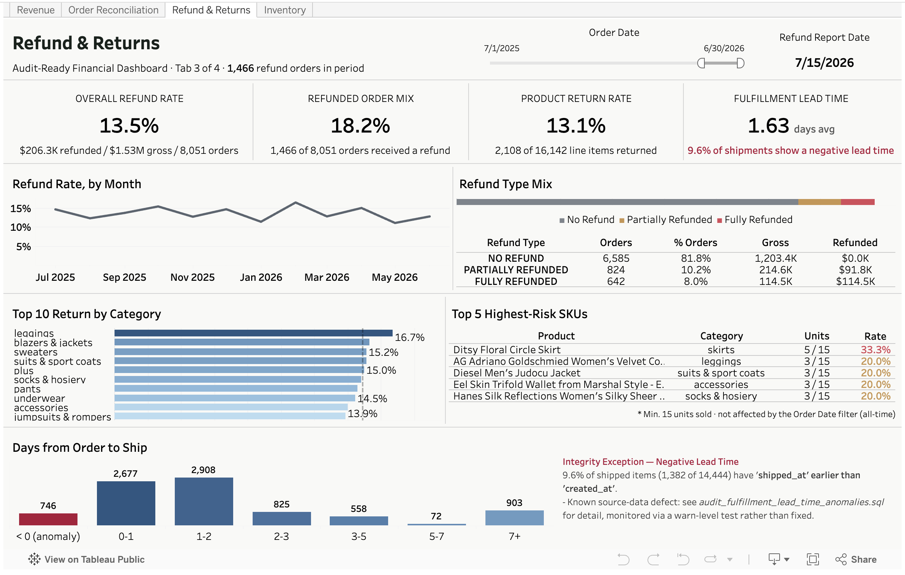

# Dashboard Showcase
A 4-tab Tableau workbook (`tableau_workbook/audit_ready_dbt_dashboard (desktop) .twb`, packaged as `(server).twbx`) consuming the CSV exports ([why CSV](semantic_layer.md#architectural-note-semantic-layer-vs-tableau)) — one tab per mart, each pairing KPI tiles with an audit-oriented drill-down, putting the [accounting logic](accounting_logic.md) into an actual audit view.

Each tab is declared as a dbt **exposure** (📂 `models/marts/finance/_finance__exposures.yml`), with an explicit `depends_on` back to its source mart(s) and an `owner`. This closes the lineage graph past the warehouse boundary — `dbt docs generate` shows not just staging → marts, but marts → the dashboards actually consuming them, so a breaking change to a mart surfaces which dashboard it would affect before it ships.

**[▶ View live on Tableau Public](https://public.tableau.com/app/profile/sam.park8167/viz/audit_ready_dbt_dashboard/Revenue)**

**① Revenue** — Gross vs. recognized revenue by month, with automated Potential Cut-off Risk detection when `shipped_at` falls in a different fiscal period than `created_at`.

**② Order Reconciliation** — Master-to-subledger status at a glance, splitting genuine reconciliation failures from benign variance patterns (partial refunds, mixed shipments) so only true exceptions surface.

**③ Refund & Returns** — Refund rate trend, product return rate by category, and a fulfillment lead-time integrity check that flags `shipped_at` timestamps recorded earlier than `created_at` — a defect traced back to the raw source data, monitored via a warn-severity dbt test rather than silently patched.

**④ Inventory** — LCM write-down and materiality-breach controls (both structurally clean), set against an Avg Days on Hand trend that's risen every year since FY2022 with no reversal — the real exposure is slow-moving stock, not mis-valued stock.

